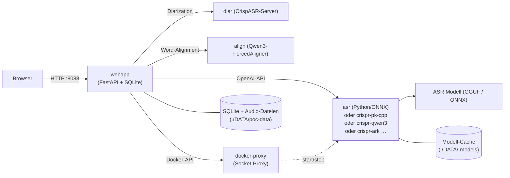

# PolySchnack — Multi-Backend Speech-to-Text

<p align="center">
  <a href="#quickstart">Quickstart</a> · <a href="#backend-auswahl">Backends</a> ·
  <a href="#architektur">Architektur</a> · <a href="#web-ui">Web UI</a> ·
  <a href="#benchmark">Benchmark</a> · <a href="#konfiguration">Konfiguration</a> ·
  <a href="#oidc-auth">OIDC</a> · <a href="#entwicklung">Entwicklung</a> ·
  <a href="https://gitlab.example.com/tilllt/polyschnack-asr/ps-pk-onnx/-/pages">📚 Vollständige Doku (GitLab Pages)</a>
</p>

<p align="center">
  
  
  
  
</p>

**OpenAI-kompatible Spracherkennung mit wählbaren ASR-Backends** — von lokalen
ggml/C++-Engines bis zur Cloud-API. Mit Web UI, Live-Transkription,
Word-Timestamps, Sprechererkennung (Diarization), OIDC-Workspaces und einem
öffentlichen **Benchmark** (WER/€-Vergleich der Backends).

Ein Befehl startet den kompletten Stack (CPU überall, GPU via Overlay) —
ohne Code, ohne Lock-in: Du wechselst das Erkennungsmodell per Env-Variable
oder per Admin-GUI, die Qualität bleibt messbar dank integriertem Benchmark.

---

## Kernbotschaft

PolySchnack ist aus **[NVIDIA Parakeet ASR](https://github.com/nvidia/parakeet)**
entstanden und wurde zu einer **Multi-Backend-Plattform** erweitert: Ein
einheitlicher OpenAI-kompatibler Endpunkt, dahinter wählbar Parakeet
(Python/ONNX oder C++), Qwen3-ASR, ARK-ASR, Moonshine-DE und Canary — jedes
mit eigener Stärke (Geschwindigkeit, Genauigkeit, Sprachen, Ressourcen).

Das Besondere:

<table>
<tr><td><b>6 ASR-Backends, ein Endpunkt</b></td><td>OpenAI-kompatible API — Drop-in für <code>openai.Audio.transcriptions.create()</code>. Backend-Wechsel per Env-Variable oder Admin-GUI, kein Code.</td></tr>
<tr><td><b>Web UI mit Wellenform</b></td><td>WaveSurfer-Player mit Zoom (1×–50×), Segment-Editor, Bereichs-Transkription, Export (SRT/VTT/TXT), Live-Preview per SSE.</td></tr>
<tr><td><b>Word-Timestamps</b></td><td>Echte Word-Level-Timestamps via Forced Aligner (Qwen3) oder modell-inhärent (Parakeet) — klickbare Wörter, springt zur Stelle.</td></tr>
<tr><td><b>Diarization</b></td><td>Sprechererkennung im eigenen CrispASR-Container — kein pyannote/CUDA-torch in der Webapp, hybrid (GPU/CPU).</td></tr>
<tr><td><b>Hybrid GPU/CPU</b></td><td>Jeder Service ist EIN Image für GPU UND CPU — ohne Overlay läuft alles auf CPU, mit <code>compose.gpu.yml</code> auf der GPU.</td></tr>
<tr><td><b>Öffentlicher Benchmark</b></td><td>2-Achsen-Test-Set (Kanal × Inhalt), hörbare Samples, WER/€-Vergleich — Qualität statt Marketing.</td></tr>
<tr><td><b>OIDC-Workspaces</b></td><td>Ohne Login: Shared Space mit Auto-Retention. Mit Login: private Workspaces + Admin-Bereich (Services on demand).</td></tr>
</table>

---

## Quickstart

**Voraussetzung:** Docker mit Compose v2. Für GPU zusätzlich das
NVIDIA Container Toolkit.

```bash
git clone <dein-repo-url>
cd polyschnack

# Variante A — CPU (läuft überall, kein NVIDIA-Toolkit nötig):
docker compose up -d

# Variante B — GPU (RTX 3090 o.ä., NVIDIA Container Toolkit installiert):
# compose.backends.yml immer mitladen — das GPU-Overlay referenziert die
# Backend-Services; ohne aktivierte Profile starten sie trotzdem nicht:
docker compose -f compose.yml -f compose.backends.yml -f compose.gpu.yml up -d

# Variante C — bequem: ./start.sh (GPU automatisch erkannt, OIDC wenn
# echte Credentials in compose.oidc.yml, alle Backends mit --no-start
# provisioniert — die Admin-GUI startet sie on demand):
./start.sh
```

- **Web UI:** http://localhost:8088
- **ASR API (direkt):** http://localhost:5092

Das Standard-Backend (Parakeet Python/ONNX, ~600 MB) lädt sein Modell beim
ersten Start von HuggingFace — keine weitere Konfiguration nötig.

**Optional: Login + Admin-Bereich** (OIDC) über das Dummy-Overlay:

```bash
docker compose -f compose.yml -f compose.oidc.yml up -d   # Werte ersetzen!
```

> **Wie Hybrid funktioniert (Weg 1):** Jeder Service ist EIN Image für GPU UND
> CPU — die CUDA/ggml-Binaries enthalten den CPU-Backend und wählen automatisch
> (`ggml_backend_init_best` = CUDA > Metal > Vulkan > CPU; approach-a nutzt
> `POLYSCHNACK_USE_GPU=auto` mit onnxruntime-gpu). Mit GPU-Zugriff (Overlay
> `compose.gpu.yml` → `runtime: nvidia`) läuft alles auf der GPU, ohne Overlay
> automatisch auf der CPU. Die **Diarization** läuft im eigenen
> CrispASR-diar-Container (`crispr-diar`, Port 5098) — ebenfalls hybrid. Die Webapp
> selbst ist **CPU-only** (kein torch/pyannote im Image, ~2,5–3 GB schlanker).

---

## Inhaltsverzeichnis

1. [Backend-Auswahl & Feature-Matrix](#backend-auswahl)
2. [Compose-Referenz (Datei-Split & Profile)](#compose-referenz)
3. [Architektur](#architektur)
4. [Web UI Features](#web-ui)
5. [Benchmark-Seite](#benchmark)
6. [Konfiguration (Env-Variablen)](#konfiguration)
7. [OIDC-Auth](#oidc-auth)
8. [Admin-Bereich](#admin-bereich)
9. [Post-Processing & Delivery](#post-processing--delivery)
10. [Entwicklung](#entwicklung)
11. [License](#license)

---

## Backend-Auswahl

PolySchnack unterstützt **mehrere ASR-Engines**. Du wechselst einfach per
Env-Variable — kein Code nötig.

| Backend | Profil | CLI-Name | Beschreibung |
|---------|--------|----------|-------------|
| **Parakeet (Python/ONNX)** | *(Default)* | `ps-pk-onnx` | Das Original-Modell von NVIDIA, 0,6B Parameter. Hybrid: GPU (CUDA) oder CPU (INT8), auto-detect. |
| **parakeet.cpp (ggml/C++)** | `--profile crispr-pk-cpp` | `crispr-pk-cpp` | Gleiches Modell, aber in C++ — schneller und schlanker (~700 MB quantisiert). Native Interpunktion + deutsches Truecasing. |
| **Qwen3-ASR (ggml/C++)** | `--profile crispr-qwen3` | `crispr-qwen3` | Neuestes ASR-Modell von Alibaba, 30 Sprachen, **Word-Timestamps** via ForcedAligner (~3 GB beide Modelle). |
| **ARK-ASR (ggml/C++)** | `--profile crispr-ark` | `crispr-ark` | State-of-the-Art auf dem HF ASR Leaderboard, 3B Parameter, Whisper-Encoder + Qwen2.5-Decoder. |
| **Moonshine-DE (ggml/C++)** | `--profile crispr-moonshine-de` | `crispr-moonshine-de` | Kompaktes deutsches Spezialmodell (61,5M Parameter, 6,9 % WER auf CV22-de, ~39 MB GGUF). ⚠️ Lizenz CC-BY-NC-SA-4.0 (nicht-kommerziell). |
| **Canary (ggml/C++)** | `--profile crispr-canary` | `crispr-canary` | NVIDIA Canary 1B v2 — multilingual (EN/DE/FR/ES). |
| **Voxtral (voxtral.cpp)** | *(geplant)* | `ps-voxtral` | Mistral AI — Speech-to-Text, 4B Parameter, natives Streaming (1 Token je 80-ms-Audioframe). **Noch nicht gebaut** — Block in `compose.backends.yml` auskommentiert. |

### Feature-Matrix der Backends

| Feature | ps-pk-onnx | crispr-pk-cpp | crispr-qwen3 | crispr-ark | crispr-moonshine-de | crispr-canary | ps-voxtral* |
|---------|-----------|--------|-----------|---------|-------------|------------|---------|
| Word-Timestamps | ✅ | ✅ | ✅ | ✅ | ✅ | ✅ | ❌ *nicht trainiert* |
| Live-Streaming (Preview) | ✅ | ❌ | ❌ | ❌ | ❌ | ❌ | ✅ |
| Async-Jobs (Hintergrund) | ✅ | ❌ | ❌ | ❌ | ❌ | ❌ | ❌ |
| Noise-Reduction (Service) | ✅ | ❌ | ❌ | ❌ | ❌ | ❌ | ❌ |
| VAD-Trimmung (Silero, extern) | ✅ | ✅ | ✅ | ✅ | ✅ | ✅ | ✅ |
| Diarization (CrispASR-diar, extern) | ✅ | ✅ | ✅ | ✅ | ✅ | ✅ | ✅ |
| Audio-Enhance (ffmpeg, extern) | ✅ | ✅ | ✅ | ✅ | ✅ | ✅ | ✅ |
| Deutsch (Hauptsprache) | ✅ | ✅ | ✅ | ✅ | ✅ (DE-Spezial) | ✅ | ✅ |
| Weitere Sprachen | EN u. a. | EN u. a. | 30 Sprachen | EN u. a. | — | EN/FR/ES | EN |
| Gerät | GPU + CPU | GPU + CPU | GPU + CPU | GPU + CPU | GPU + CPU | GPU + CPU | GPU |
| Modellgröße (Download) | ~2,4 GB | ~0,7 GB | ~3 GB | ~3,2 GB | ~39 MB | ~0,5 GB | ~2,7 GB |

*Voxtral ist **geplant** (Block in `compose.backends.yml` auskommentiert, kein
Image gebaut) — die Zeile zeigt die Zielwerte. Die Matrix ist auch live in der
GUI (Admin-Bereich → „Modell-Matrix") und via `GET /api/models/matrix` abrufbar.*

### Backends starten & Modelle laden

**Parakeet (Python/ONNX) — Standard, einfach loslegen**

```bash
docker compose up -d
```

**parakeet.cpp — schneller und schlanker**

```bash
CRISPR_PK_CPP_URL=http://crispr-pk-cpp:5093 ASR_BACKEND=crispr-pk-cpp \
  docker compose -f compose.yml -f compose.backends.yml --profile crispr-pk-cpp up -d

# Modell einmalig laden:
docker run --rm -v "$PWD/DATA/models:/models" alpine wget -O /models/parakeet-tdt-0.6b-v3-q8_0.gguf \
  https://huggingface.co/cstr/parakeet-tdt-0.6b-v3-GGUF/resolve/main/parakeet-tdt-0.6b-v3-q8_0.gguf
```

> **Achtung:** `CRISPR_PK_CPP_URL` ist die **eigene** Env-Variable des crispr-pk-cpp-Adapters —
> nicht `ASR_URL` verwenden (das ist der ONNX-ps-pk-onnx-Container).

**Qwen3-ASR — beste Spracherkennung + Word-Timestamps**

```bash
CRISPR_QWEN3_URL=http://crispr-qwen3:5094 ASR_BACKEND=crispr-qwen3 \
  docker compose -f compose.yml -f compose.backends.yml --profile crispr-qwen3 up -d

# Zwei Modelle (~3 GB): ASR (Q8_0) + ForcedAligner (F16):
docker run --rm -v "$PWD/DATA/models:/models" alpine sh -c '
  wget -qO /models/qwen3-asr-0.6b-q8_0.gguf \
    https://huggingface.co/OpenVoiceOS/qwen3-asr-0.6b-q8-0/resolve/main/qwen3-asr-0.6b-q8_0.gguf &&
  wget -qO /models/qwen3-forced-aligner-0.6b-f16.gguf \
    https://huggingface.co/OpenVoiceOS/qwen3-forced-aligner-0.6b-f16/resolve/main/qwen3-forced-aligner-0.6b-f16.gguf
'
```

**ARK-ASR — State-of-the-Art Erkennung**

```bash
CRISPR_ARK_URL=http://crispr-ark:5095 ASR_BACKEND=crispr-ark \
  docker compose -f compose.yml -f compose.backends.yml --profile crispr-ark up -d

# GGUF (~4 GB, Q8_0) einmalig laden:
docker run --rm -v "$PWD/DATA/models:/models" alpine wget -O /models/ark-asr-3b-q8_0.gguf \
  https://huggingface.co/cstr/ark-asr-3b-GGUF/resolve/main/ark-asr-3b-q8_0.gguf
```

**Moonshine-DE — kompaktes Deutsches Spezialmodell**

```bash
ASR_BACKEND=crispr-moonshine-de \
  docker compose -f compose.yml -f compose.backends.yml --profile crispr-moonshine-de up -d

# Modell + Tokenizer (~42 MB):
docker run --rm -v "$PWD/DATA/models:/models" alpine sh -c '
  wget -qO /models/moonshine-base-de-fidoriel-q4_k.gguf \
    https://huggingface.co/cstr/moonshine-base-de-fidoriel-GGUF/resolve/main/moonshine-base-de-fidoriel-q4_k.gguf &&
  wget -qO /models/tokenizer.bin \
    https://huggingface.co/cstr/moonshine-base-de-fidoriel-GGUF/resolve/main/tokenizer.bin
'
```

> ⚠️ **Lizenz:** CC-BY-NC-SA-4.0 — nicht für kommerzielle Nutzung.

**Canary — multilingual (EN/DE/FR/ES)**

```bash
ASR_BACKEND=crispr-canary \
  docker compose -f compose.yml -f compose.backends.yml --profile crispr-canary up -d

# Modell (~0,6 GB, q4_K):
docker run --rm -v "$PWD/DATA/models:/models" alpine wget -O /models/canary-1b-v2-q4_k.gguf \
  https://huggingface.co/cstr/canary-1b-v2-GGUF/resolve/main/canary-1b-v2-q4_k.gguf
```

### Diarization (Sprechererkennung) — CrispASR-diar-Service

Die Diarization läuft **nicht in der Webapp** (kein pyannote, kein
CUDA-torch), sondern im eigenen `crispr-diar`-Container — einem schlanken
CrispASR-Server, der nur für die Sprechererkennung zuständig ist und
unabhängig vom gewählten ASR-Backend funktioniert:

- **Im Default-Stack enthalten** (`compose.yml` → `crispr-diar`), Healthcheck aktiv
- **GPU** via Overlay (`compose.gpu.yml` → `runtime: nvidia`), sonst CPU (ggml)
- Kein HF_TOKEN nötig — die Webapp ruft nur `POST /v1/audio/transcriptions`
  mit `diarize=true&response_format=diarized_json` auf

```bash
# Das Modell (parakeet-GGUF q8_0, ~640 MB) lädt der Container beim ersten
# Start automatisch von HuggingFace in ./DATA/models/ — manuell nur nötig,
# wenn er keinen Internetzugang hat (gleiche Datei wie parakeet.cpp, nur
# einmal laden):
docker run --rm -v "$PWD/DATA/models:/models" alpine wget -O /models/parakeet-tdt-0.6b-v3-q8_0.gguf \
  https://huggingface.co/cstr/parakeet-tdt-0.6b-v3-GGUF/resolve/main/parakeet-tdt-0.6b-v3-q8_0.gguf
```

Die Methode ist per `DIARIZE_METHOD` wählbar (Webapp-Env): `pyannote`
(Default), `foxnose` (WeSpeaker-ResNet34, beste Accuracy), `energy`/`xcorr`/
`vad-turns` (leichtgewichtig). Die „Sprecheranzahl" aus der UI wird als
`diarize_max_speakers` übertragen.

---

## Compose-Referenz

Der Stack ist bewusst in **fünf Compose-Dateien** aufgeteilt — jede hat eine
einzige Aufgabe:

- **`compose.yml` (Main)** — Kern-Stack: `docker-proxy` (Socket-Proxy für die
  Admin-Steuerung), `asr` (Parakeet Python/ONNX, Container `ps-pk-onnx`),
  `diar` (CrispASR-Diarization, Container `crispr-diar`),
  `align` (Forced-Aligner, Container `crispr-align` — präzise Word-Timestamps
  für den Karaoke-Sync)
  und `webapp` (GUI, Container `ps-webapp`). Wird von `docker compose up`
  automatisch geladen.
- **`compose.backends.yml`** — die optionalen Backends `asr-cpp` (Container
  `crispr-pk-cpp`), `qwen3-asr` (Container `crispr-qwen3`), `ark-asr`
  (Container `crispr-ark`), `moonshine-de` (Container `crispr-moonshine-de`),
  `canary-asr` (Container `crispr-canary`; Voxtral `ps-voxtral`: geplant),
  jeweils über **Docker-Profile** aktivierbar.
- **`compose.gpu.yml`** — GPU-Overlay (`runtime: nvidia` für alle hybriden
  Services). Nur auf Maschinen mit NVIDIA Container Toolkit einbinden.
- **`compose.oidc.yml`** — OIDC-Overlay mit Dummy-Werten (Login + Admin).
- **`compose.benchmark.yml`** — Benchmark als Einmal-Container (per Host-Cron
  oder manuell), schreibt Ergebnisse ins gemeinsame Volume.

**Warum Profile statt `docker-compose.override.yml`?** Eine Override-Datei wird
von Compose **immer automatisch gemergt** — die Backends wären dauerhaft Teil
des Stacks. Profile halten sie optional: definiert, aber nur gestartet, wenn
`--profile <name>` gesetzt wird. Die Admin-GUI kann die (per `--no-start`
erzeugten) Container trotzdem on demand starten/stoppen.

**Warum GPU als Overlay statt hardcodiert?** `runtime: nvidia` in der
Main-Compose würde den Stack auf Maschinen ohne NVIDIA-Runtime unstartbar
machen. Das Overlay ist die einzige Stelle, an der GPU-Zugriff vergeben wird.

**Warum OIDC als Overlay?** Ohne Login läuft PolySchnack als öffentlicher
Shared Space (bewusst). OIDC ist ein optionales Upgrade — das Dummy-Overlay
macht die Aktivierung dokumentierbar und trotzdem offensichtlich ersetzbar.

```bash
# Nur Kern (GUI + ONNX, CPU oder GPU via Overlay):
docker compose up -d                                   # CPU
docker compose -f compose.yml -f compose.gpu.yml up -d # GPU

# Kern + Backends (Container erzeugen, GUI startet on demand):
docker compose -f compose.yml -f compose.backends.yml \
  --profile crispr-pk-cpp --profile crispr-qwen3 --profile crispr-ark up -d --no-start

# Kern + einzelnes Backend direkt mitstarten:
docker compose -f compose.yml -f compose.backends.yml --profile crispr-pk-cpp up -d

# Kern + OIDC-Login (Dummy-Werte vorher ersetzen!):
docker compose -f compose.yml -f compose.oidc.yml up -d
```

### Profile im Detail

| Profil | Befehl | Startet | GPU via Overlay |
|--------|--------|---------|:---------:|
| *(kein Profil)* | `docker compose up -d` | docker-proxy + asr + diar + webapp | ✅ |
| `--profile crispr-pk-cpp` | `docker compose -f compose.yml -f compose.backends.yml --profile crispr-pk-cpp up -d` | + crispr-pk-cpp | ✅ |
| `--profile crispr-qwen3` | `docker compose -f compose.yml -f compose.backends.yml --profile crispr-qwen3 up -d` | + crispr-qwen3 | ✅ |
| `--profile crispr-ark` | `docker compose -f compose.yml -f compose.backends.yml --profile crispr-ark up -d` | + crispr-ark | ✅ |
| `--profile crispr-moonshine-de` | `docker compose -f compose.yml -f compose.backends.yml --profile crispr-moonshine-de up -d` | + crispr-moonshine-de | ✅ |
| `--profile crispr-canary` | `docker compose -f compose.yml -f compose.backends.yml --profile crispr-canary up -d` | + crispr-canary | ✅ |

### Adapter-URLs (jedes Backend hat seine eigene!)

Das Backend wird über die Adapter-Auswahl gesteuert — **jeder Adapter hat
seine eigene URL-Env** (nie `ASR_URL` für andere Backends verwenden — das ist
der ONNX-ps-pk-onnx-Container!):

| Variable | Default | Beschreibung |
|----------|---------|-------------|
| `ASR_BACKEND` | `ps-pk-onnx` | Adapter-Auswahl (`ps-pk-onnx`, `crispr-pk-cpp`, `crispr-qwen3`, `crispr-ark`, `crispr-moonshine-de`, `crispr-canary`) |
| `ASR_URL` | `http://ps-pk-onnx:5092` | URL des ONNX-ps-pk-onnx-Containers |
| `CRISPR_PK_CPP_URL` | `http://crispr-pk-cpp:5093` | URL des crispr-pk-cpp-Containers (CrispASR parakeet) |
| `CRISPR_QWEN3_URL` | `http://crispr-qwen3:5094` | URL des crispr-qwen3-Containers |
| `CRISPR_ARK_URL` | `http://crispr-ark:5095` | URL des crispr-ark-Containers (CrispASR) |
| `CRISPR_MOONSHINE_DE_URL` | `http://crispr-moonshine-de:5096` | URL des crispr-moonshine-de-Containers |
| `CRISPR_CANARY_URL` | `http://crispr-canary:5097` | URL des crispr-canary-Containers |
| `CRISP_ALIGN_URL` | `http://crispr-align:5099` | URL des Forced-Aligner-Service (Karaoke-Word-Sync) |
| `POLYSCHNACK_ALIGN_WORDS` | `true` | Word-Alignment nach der ASR aktiv/deaktiviert (`false` = aus) |

```bash
# WICHTIG: ASR_BACKEND IMMER explizit setzen — ohne Adapter-Auswahl fällt
# get_client() still auf ps-pk-onnx zurück und postet gegen den ONNX-Container!
CRISPR_QWEN3_URL=http://crispr-qwen3:5094 ASR_BACKEND=crispr-qwen3 docker compose -f compose.yml -f compose.backends.yml --profile crispr-qwen3 up -d

# Kombination mehrerer Backends (Admin-GUI startet sie on demand):
docker compose -f compose.yml -f compose.backends.yml \
  --profile crispr-pk-cpp --profile crispr-qwen3 --profile crispr-ark up -d --no-start
```

> **Hinweis:** Modell-Dateien liegen in Bind-Mounts unter `./DATA/<name>-models/`
> (keine Named-Volumes). Die vollständigen Service-Definitionen stehen in
> `compose.yml` / `compose.backends.yml`.

---

## Architektur



Die Webapp kommuniziert mit den ASR-Backends über die OpenAI-kompatible
`POST /v1/audio/transcriptions`-Schnittstelle. Der Adapter wird durch die
Umgebungsvariable `ASR_BACKEND` gesteuert. Die Diarization läuft im eigenen
`diar`-Container (CrispASR-Server, `POST /v1/audio/transcriptions` mit
`diarize=true&response_format=diarized_json`). Der **Forced Aligner**
(`align`-Container, `POST /v1/audio/align` mit Audio + Referenztext) verifiziert
nach der ASR jede Wortgrenze gegen die Akustik (qwen3-forced-aligner,
einzelner nicht-autoregressiver Forward-Pass, max. 400 s Audio pro Request) —
die Webapp schickt ihre 120-s-Chunks, ersetzt die groben Backend-Word-Timestamps
durch akustisch verifizierte und behebt so den Karaoke-Drift bei langen Audios.
Die Admin-GUI steuert die
Backend-Container über den restriktiven `docker-proxy` (kein direkter
Docker-Socket-Zugriff aus der Webapp).

---

## Web UI

### Upload & Transcribe

1. **Datei hochladen** — Drag & Drop oder Klick (MP3, WAV, OGG, OPUS, M4A, FLAC, WEBM)
2. **▶ Transkribieren** — die Feature-Toggles (VAD, Diarization, Noise Reduction, Live, Enhance) und das Backend docken direkt an der Zeile an, auf der du transkribierst
3. **Transcribe-Queue** — mehrere Transkriptionen werden pro Backend serialisiert (Kapazität je Endpunkt = 1); Position und ETA zeigt der Queue-Watcher
4. **Wellenform + Zoom** — WaveSurfer mit Zoom (1×–50×)
5. **Bereich wählen** — blauen Griff ziehen, um nur einen Ausschnitt zu transkribieren
6. **Re-transkribieren** — Klick auf „Re-transcribe" klappt die Feature-Auswahl an der Zeile auf und wird zum ▶-Button (ohne Bestätigungsdialog)
7. **Playback** — Klick auf Segment zum Abspielen

### Weitere Features

- **Segment-Editor** — Doppelklick auf Text, `Ctrl+Enter` speichert
- **Export** — SRT, VTT, TXT (mit Sprecher-Labels wenn Diarization aktiv)
- **Duplicate Detection** — gleiche Datei erkennen und überspringen
- **Auto-Retention** — öffentliche Aufnahmen nach 60 Minuten löschen

---

## Benchmark

Öffentliche Seite unter **`https://<webapp>/benchmark`** (Pfad unter der
Webapp, keine Subdomain) — Methodik, hörbare Samples, Ergebnisse und
Preisvergleich.

### Für normale User (kein Login nötig)

- **Methodik-Karte** — Version, Stand, Kategorien, Anti-Gaming-Hinweis
- **Test-Set · 2-Achsen-Matrix** — Kanal × Inhalt als 8×8-Matrix mit
  Sample-Zählung; Klick auf eine Zelle **filtert die Samples** darunter
- **„Wie ist das Test-Set aufgebaut?"** — verständliche Erklärung der
  Taxonomie (Best Practice aus GigaSpeechBench/LibriSpeech/REVERB/CHiME)
- **Samples nach Kategorie** (collapsible, nur eine offen):
  - **Preview** (MP3 128 kbps, WaveSurfer-Player) + **finale WAV** (unkomprimiert, Download)
  - Referenztext ein-/ausblendbar
- **Ergebnisse** — gepoolte Benchmark-Ergebnisse (`results/latest.json`)
- **Preisvergleich** — WER/€-Matrix (Selbstkosten vs. SaaS vs. kommerziell)

Bearbeiten ist **nicht** möglich — Read-only für normale User.

### Taxonomie (2-Achsen)

Die Samples sind nach zwei unabhängigen Achsen kategorisiert (Definition in
`benchmark/spec/taxonomy.json` im polyschnack-benchmark-Repo):

- **Kanal (Akustik)** — wie klingt die Aufnahme? `clean`, `transport`,
  `broadcast`, `telefon`, `komprimiert`, `vintage`, `geraeusch`, `nachhall`
- **Inhalt (Schwierigkeit)** — was wird gesprochen? `allgemein`, `schnell`,
  `zahlen`, `fachsprache`, `akzent`, `jugend`, `codeswitch`, `durchsagen`
- **Quelle (Tag, keine Kategorie):** `cv` = echte CommonVoice-Stimmen (CC0),
  `tts` = synthetisch (**Piper** Thorsten m / Ramona w — ersetzt edge-tts)

### Für Admins (OIDC-Login + `POLYSCHNACK_ADMINS`)

- **✕ Ablehnen** pro Sample → Auto-Ersatz aus dem CV-Pool (gleiche Kategorie)
  und **neue Version vN+1** (Manifest-History bleibt erhalten)
- **Edit** pro Sample → Referenztext ändern (in-place, `updated_at`)
- Versions-History unter `/api/benchmark/versions`

### Datenlayout (`benchmark_data`)

```
benchmark_data/
  versions/v1/manifest.json   # Samples + Kategorien (immutable pro Version)
  versions/v1/audio/*.wav     # finale WAV (unkomprimiert)
  versions/v1/preview/*.mp3   # MP3 128k (on-demand via ffmpeg)
  results/latest.json         # gepoolte Ergebnisse
  pricing.json                # Preisvergleich (Selbstkosten × markup_x)
```

`BENCHMARK_DATA_DIR` (Default: `/data/benchmark`) zeigt auf das Volume.
Seed: `webapp/benchmark/seed_benchmark_data.py` (manuell, nie in CI).
API-Doku: `GET /api/benchmark/meta`, `/samples`, `/audio/{id}`, `/preview/{id}`,
`/results`, `/pricing`, `/versions` — POST `/reject`, `/edit` (Admin only).

### Benchmark-Container (periodisch per Cron)

Der Benchmark läuft **nicht** als dauerhafter Service, sondern als
**Einmal-Container**, der per Host-Cron periodisch gestartet wird — er
schreibt die Ergebnisse ins gemeinsame Volume, die Webapp zeigt sie an.

```bash
# Einmal manuell:
docker compose -f compose.yml -f compose.benchmark.yml run --rm benchmark

# Periodisch (Host-Crontab, z. B. täglich 04:00):
0 4 * * * cd /srv/app/pk-asr && docker compose -f compose.yml -f compose.benchmark.yml run --rm benchmark >> /var/log/polyschnack-benchmark.log 2>&1
```

**Was der Container tut:**
- Liest das aktuelle versionierte Manifest (`versions/vN/manifest.json`,
  aktive Samples) aus dem gemeinsamen Volume
- Schickt jedes Sample an die konfigurierten Backends (OpenAI-kompatibel,
  Compose-Netzwerk — Backends müssen laufen!)
- Schreibt `results/latest.json` + `pricing.json` ins Volume
  (`/data/benchmark`) — die Webapp zeigt sie ohne Neustart an

**Konfiguration** (`compose.benchmark.yml`):

| Variable | Default | Bedeutung |
|----------|---------|-----------|
| `BENCH_BACKENDS` | `ps-pk-onnx,crispr-qwen3,crispr-ark,crispr-moonshine-de,crispr-canary,crispr-pk-cpp` | Welche Backends laufen sollen |
| `BENCH_BACKEND_URLS` | JSON-Map (s. Datei) | URLs im Compose-Netzwerk (Container-Port!) |

**Volumes (Least-Privilege):** `/data` read-only, nur `/data/benchmark`
beschreibbar (Container schreibt ausschließlich latest.json + pricing.json).
CPU-only, endet nach dem Lauf — kein Leerlauf-Ressourcenverbrauch.

**Image-Build:** CI-Job `build-benchmark` im polyschnack-benchmark-Repo
(baut + pusht nach Harbor). Achtung: benötigt die CI-Variable `CONFIG_JSON`
(Harbor-Docker-Config) — das Benchmark-Projekt hat sie noch **nicht**
(im pk-asr-Projekt existiert sie). Siehe Fehlermeldung im CI-Log.

## Wichtig vor dem Deployment

Die Benchmark-Seite zeigt **ohne Seed-Daten nichts** („Benchmark-Daten sind
noch nicht verfügbar"). Vor dem ersten Start das Volume befüllen:

```bash
cd webapp
SELECTION=/srv/app/polyschnack-benchmark/benchmark/selection/cv_selection_v1.json \
TTS_SELECTION=/srv/app/polyschnack-benchmark/benchmark/selection/tts_selection.json \
CV_WAV_DIR=/srv/app/polyschnack-benchmark/benchmark/data/cv \
TTS_WAV_DIR=/srv/app/polyschnack-benchmark/benchmark/data/tts \
TAXONOMY=/srv/app/polyschnack-benchmark/benchmark/spec/taxonomy.json \
BENCHMARK_DATA_DIR=<host-mount>/benchmark \
.venv/bin/python benchmark/seed_benchmark_data.py
```

- `BENCHMARK_DATA_DIR` muss auf den **Host-Pfad des Volumes** zeigen
  (compose: `./DATA/poc-data:/data` → `DATA/poc-data/benchmark`).
- Der Seed kopiert die WAVs (unkomprimiert) und erzeugt die MP3-128k-Previews
  per ffmpeg.

---

## Konfiguration

### ASR-Backend wählen

| Variable | Werte | Default |
|----------|-------|---------|
| `ASR_BACKEND` | `ps-pk-onnx`, `crispr-pk-cpp`, `crispr-qwen3`, `crispr-ark`, `crispr-moonshine-de`, `crispr-canary` | `ps-pk-onnx` |
| `ASR_URL` | URL des ONNX-Dienstes | `http://ps-pk-onnx:5092` |
| `POLYSCHNACK_DEFAULT_BACKEND` | wie `ASR_BACKEND` (Default für neue Jobs, per Admin-GUI änderbar) | `ps-pk-onnx` |

### Webapp-Umgebungsvariablen

| Variable | Default | Beschreibung |
|----------|---------|-------------|
| `ASR_URL` | `http://ps-pk-onnx:5092` | ASR-Service-URL |
| `ASR_BACKEND` | `ps-pk-onnx` | Welcher Adapter |
| `VAD_TRIM_SILENCE` | `false` | Stille-Trimmung aktivieren |
| `DIAR_URL` | `http://crispr-diar:5098` | Diarization-Service (CrispASR-diar-Container) |
| `DIARIZE_METHOD` | `pyannote` | Diarization-Methode (`pyannote`\|`foxnose`\|`energy`\|…) — per GUI überschreibbar |
| `PUBLIC_RETENTION_MINUTES` | `60` | Auto-Löschung öffentl. Aufnahmen |
| `OIDC_CLIENT_ID` | `""` | OIDC-Client-ID (leer = kein Auth) |
| `OIDC_ISSUER` | `""` | OIDC-Issuer-URL |
| `SESSION_SECRET` | auto | Session-Key |
| `BASE_URL` | `http://localhost:8088` | Externe URL für OIDC-Redirects |
| `POLYSCHNACK_ADMINS` | `""` | Komma-Liste (OIDC-sub oder E-Mail) mit Admin-Rechten |
| `POLYSCHNACK_ADMIN_GROUPS` | `""` | Komma-Liste von OIDC-Gruppen mit Admin-Rechten |
| `DOCKER_PROXY_URL` | `http://docker-proxy:2375` | Restriktiver Docker-Socket-Proxy |
| `POLYSCHNACK_MAX_QUEUE_LEN` | `20` | Maximale Jobs in der Transcribe-Queue |

---

## OIDC-Auth

Ohne OIDC läuft PolySchnack als **Shared Space**: jede\*r kann hochladen und
transkribieren, alles ist öffentlich und wird nach `PUBLIC_RETENTION_MINUTES`
automatisch gelöscht.

Mit OIDC bekommt jede\*r eingeloggte User einen **privaten Workspace** (eigene
Aufnahmen, fremde unsichtbar). Der Admin-Bereich (Service-Start/Stop,
Backend-Wechsel) setzt OIDC zwingend voraus — ohne Login gibt es keine Admins.

**Fertiges Compose-Overlay mit Dummy-Werten:** `compose.oidc.yml`

```bash
docker compose -f compose.yml -f compose.oidc.yml up -d
```

Alle Werte dort sind DUMMY (Client-ID/Secret, `auth.example.com`,
`admin@example.com`) — vor Produktion ersetzen.

### Aktivierung

| Variable | Beispiel | Bedeutung |
|----------|----------|-----------|
| `OIDC_CLIENT_ID` | `polyschnack` | Client-ID beim Identity Provider |
| `OIDC_CLIENT_SECRET` | `…` | Client-Secret beim IdP (Confidential Client) |
| `OIDC_ISSUER` | `https://auth.example.com` | Issuer-URL (Keycloak, Authentik, …) — **OIDC ist aktiv, sobald Client-ID + Issuer gesetzt sind** |
| `OIDC_SCOPE` | `openid profile email` | Standard; `email` wird benötigt, wenn Admins per E-Mail matchen sollen |
| `SESSION_SECRET` | zufälliger langer String | Signiert die Session-Cookies — **unbedingt setzen** |
| `BASE_URL` | `https://polyschnack.example.com` | Externe URL der App; **der OIDC-Redirect läuft immer hierhin** |

**Einmalig beim IdP registrieren:**
- Redirect-URI: `https://<BASE_URL>/auth/callback` (exakt, ohne Trailing-Slash)
- Flow: Authorization Code + PKCE (Confidential Client)
- Für Admin-Match per Gruppe: `groups`-Claim im Userinfo (Keycloak:
  Gruppen-Mapper; Authentik: standardmäßig enthalten)

**Login-Ablauf:** `GET /auth/login` → Redirect zum IdP → `GET /auth/callback`
(setzt Session, speichert `is_admin`) → zurück zur App. `GET /auth/logout`
löscht die Session.

**Eigene User-ID finden:** eingeloggt `GET /auth/me` → `sub`, `email`, `name`,
`is_admin`.

### Admins designieren

- `POLYSCHNACK_ADMINS` — Komma-Liste von `sub`-IDs **oder** E-Mails
- `POLYSCHNACK_ADMIN_GROUPS` — Komma-Liste von OIDC-Gruppennamen

Beide wirken **unabhängig voneinander** (ODER-Verknüpfung):

1. **sub/email-Liste:** Beim Login wird der User in der DB angelegt bzw.
   aktualisiert. Der Check vergleicht `user.sub` und `user.email` exakt.
2. **Gruppen:** Beim Login holt die App die Userinfo vom IdP
   (`GET {issuer}/userinfo`) und bildet die Schnittmenge aus
   `userinfo["groups"]` und der Komma-Liste. Ist sie nicht leer → Admin.

**Zeitpunkt & Gültigkeit:** `is_admin` wird einmalig beim Login berechnet und
in der Session gecacht. Nach Änderungen der Admin-Variablen **neu einloggen**
(Logout → Login). Ohne aktives OIDC liefert `require_admin` immer 403.

---

## Admin-Bereich

Der Admin-Bereich (`🛠 Admin` in der GUI, nur für Admins) steuert die
ASR-Services on demand — die Webapp spricht dafür **niemals direkt** den
Docker-Socket an, sondern den restriktiven Proxy-Container
[`tecnativa/docker-socket-proxy`](https://github.com/Tecnicality/docker-socket-proxy)
(nur Container-/Info-Routen + POST freigeschaltet; Exec/Create/Events deaktiviert).

- **Services** — alle Backends mit Live-Status, Modell, Ressourcen-Report
  (VRAM/RAM/Disk), aktiven Jobs und Start/Stop/Neustart. Stop nur ohne
  laufende Jobs (sonst 409).
- **Ressourcen-Check vor Start** — RAM/Disk werden vor dem Start geprüft
  (VRAM exakt nur bei eigenen Servern über deren `/health`). Bei Mangel: 409
  mit Report.
- **Config** — Default-Backend für neue Transkriptionen. Wechsel auf ein
  nicht-laufendes Backend startet es automatisch (nach Ressourcen-Check).
- **Modell-Matrix** — Feature-Übersicht aller Backends, auch als
  `GET /api/models/matrix`.

**Concurrency** ist bewusst nicht konfigurierbar: Jeder Endpunkt hat eine
Kapazität (selbstgehostete Services = 1). Die Queue (`GET /api/queue`) zeigt
eigene Jobs mit Position/ETA, fremde anonymisiert.

**Einmaliger Setup-Befehl** (erstellt alle Container, startet aber nichts):

```
docker compose -f compose.yml -f compose.backends.yml --profile crispr-pk-cpp --profile crispr-qwen3 --profile crispr-ark --profile crispr-moonshine-de --profile crispr-canary up -d --no-start
```

---

## Post-Processing & Delivery

Alles ist **opt-in** (nichts läuft automatisch): an der Transcribe-Zeile
wählst du pro Aufnahme, was nach der Transkription passieren soll.

- **Satzzeichen (`✍️ Punct`)** — Interpunktion nach der Erkennung. Modus per
  `POLYSCHNACK_PUNCTUATION_MODE` (Default `off`; `local` = offline, `llm` =
  kostenpflichtig). **Achtung:** Die CrispASR-Backends (Qwen3-ASR, ARK-ASR,
  pk-cpp) punktieren **nativ** vom Server (`--punc-model fullstop`,
  `--truecase-model lstm` = deutsches Truecasing, 97,9 % F1) — dort wird das
  LLM-Punctuation automatisch übersprungen.
- **Wort-Confidence (Per-Token)** — CrispASR-Backends liefern pro Wort eine
  Sicherheit. Die Webapp färbt unsichere Wörter: **grün** ≥ 90 %, **gelb**
  ≥ 70 %, **rot** darunter.
- **LLM-Optimierung (`✨ LLM`)** — KI-Nachbearbeitung. **Nur für registrierte
  User** (kostenpflichtig), anonyme sehen den Schalter ausgegraut.
- **Vorlage (Template)** — eigene Prompt-Vorlagen im Panel
  `🧩 Post-Processing` (z. B. „Meeting-Zusammenfassung + ToDos"). Ergebnis
  wird als neue Version (`kind="postprocess"`) abgelegt.
- **Senden an (Delivery-Target)** — E-Mail (SMTP) oder **WebDAV** (z. B.
  Nextcloud). Passwörter **verschlüsselt** (Fernet, aus `SESSION_SECRET`),
  nie wieder ausgegeben. Auch für anonyme User.

**Umgebungsvariablen:**

| Variable | Default | Bedeutung |
|---|---|---|
| `POLYSCHNACK_PUNCTUATION_MODE` | `off` | `off` \| `local` \| `llm` |
| `POLYSCHNACK_DEFAULT_LLM_ENHANCE` | `false` | LLM-Optimierung default an |
| `POLYSCHNACK_LLM_URL` | *(leer)* | OpenAI-kompatibler Endpunkt (z. B. eigener LiteLLM-Proxy) |
| `POLYSCHNACK_LLM_API_KEY` | *(leer)* | API-Key für obigen Endpunkt |
| `POLYSCHNACK_LLM_MODEL` | `deepseek-chat` | Modellname |
| `POLYSCHNACK_SMTP_HOST` | *(leer)* | SMTP-Server (leer = Mail-Targets deaktiviert) |
| `POLYSCHNACK_SMTP_PORT` | `587` | SMTP-Port |
| `POLYSCHNACK_SMTP_USER` / `_PASS` | *(leer)* | SMTP-Login |
| `POLYSCHNACK_SMTP_FROM` | *(leer)* | Absender-Adresse |

### BYOK — eigene LLM-Endpunkte (registrierte User)

Registrierte User (OIDC) können eigene OpenAI-kompatible Endpunkte
hinterlegen (Tab „LLM-Endpunkte (BYOK)" im Panel `🧩 Post-Processing`).
Priorität: **User-Endpunkt > Server-Env**.

- **Anlegen:** Name, Base-URL, API-Key, Modell. Der API-Key wird
  **Fernet-verschlüsselt** gespeichert und **nie** in GUI/API/Logs ausgegeben.
- **Sicherheit (SSRF):** Nur http(s) und **öffentliche** Adressen.
  `localhost`, private Netze und Cloud-Metadata (169.254.169.254) → 422.
- **Zugriff:** Nur der Ersteller (owner-only). BYOK ist kostenpflichtig →
  anonyme User gesperrt (403).

---

## Entwicklung

### Spezifikation (OpenSpec)

Die App ist retroaktiv in [OpenSpec-Format](openspec/) spezifiziert:
`openspec/project.md` (Überblick + External Systems), `openspec/specs/*/spec.md`
(7 Capabilities mit Requirements/Scenarios) und `openspec/changes/*/proposal.md`
(5 Change-Proposals der Feature-Epochen). **Pflege:** Neue Features → neues
Change-Proposal + Spec-Abschnitt aktualisieren (gleicher Commit).

### Voraussetzungen

- [uv](https://docs.astral.sh/uv/) (Python Package Manager)
- Node.js 20+
- Docker mit Compose v2

### ASR Backend (approach-a)

```bash
cd approach-a
uv sync
uv run uvicorn polyschnack_service.main:app --reload --port 5092
```

### Web App

```bash
cd webapp/frontend
npm install
npm run dev              # Vite Dev Server auf :5173

# Zweites Terminal:
cd webapp
PS_PK_ONNX_URL=http://localhost:5092 uv run uvicorn app.main:app --reload --port 8088
```

### Tests

```bash
# Backend (webapp):
cd webapp && uv run pytest tests/ -q

# Frontend:
cd webapp/frontend && npm test        # Vitest
```

---

## License

[MIT](LICENSE) — basiert auf [istupakov/parakeet-tdt](https://github.com/istupakov/parakeet-tdt)
(NVIDIA Parakeet TDT 0.6B v3) und [mudler/parakeet.cpp](https://github.com/mudler/parakeet.cpp).
