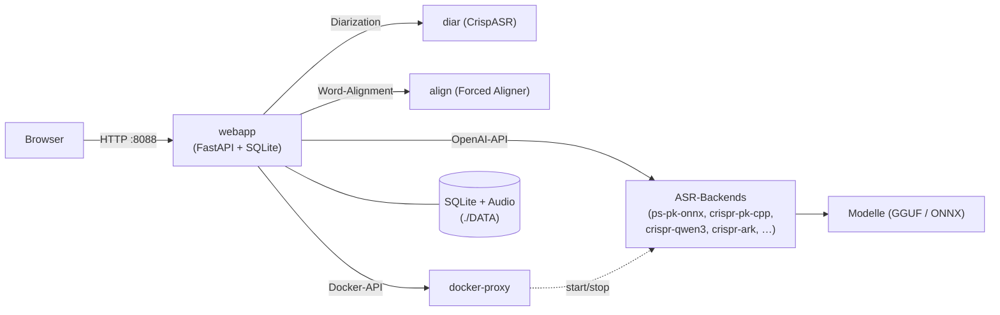

# PolySchnack — Multi-Backend Speech-to-Text

<p align="center">
  <a href="#quickstart">Quickstart</a> · <a href="#architektur">Architektur</a> ·
  <a href="#weiterführende-dokumentation">Doku</a> ·
  <a href="docs/index.md">📚 Vollständige Dokumentation</a>
</p>

<p align="center">
  
  
  
</p>

**OpenAI-kompatible Spracherkennung mit wählbaren ASR-Backends** — von lokalen
ggml/C++-Engines bis zu eigenen Remote-API-Endpunkten. Mit Web UI,
Live-Transkription, Word-Timestamps, Sprechererkennung (Diarization),
Kollaborativer Bearbeitung, OIDC-Workspaces und öffentlichem Benchmark
(WER/€-Vergleich der Backends).

Ein Befehl startet den kompletten Stack (CPU überall, GPU optional) — ohne
Code, ohne Lock-in: Du wechselst das Erkennungsmodell per Env-Variable oder
per Admin-GUI, die Qualität bleibt messbar dank integriertem Benchmark.

> Aus **[NVIDIA Parakeet ASR](https://github.com/nvidia/parakeet)** entstanden,
> heute eine Multi-Backend-Plattform: Parakeet (ONNX + C++), Qwen3-ASR,
> ARK-ASR, Moonshine-DE, Canary, Voxtral und Whisper — jedes Backend mit
> eigener Stärke (Geschwindigkeit, Genauigkeit, Sprachen, Ressourcen).
> Details: [docs/backends/overview.md](docs/backends/overview.md)

---

## Architektur (kurz)



- **Webapp** (FastAPI, CPU-only): Upload/Queue/Web-UI, spricht alle Backends
  über eine OpenAI-kompatible Schnittstelle an.
- **ASR-Backends** (eigene Container, hybrid GPU/CPU): je ein Image pro
  Engine, Modelle liegen gemeinsam in `./DATA/models`.
- **Diarization & Aligner** als eigene CrispASR-Container — unabhängig vom
  gewählten ASR-Backend.
- **Admin-GUI** startet/stoppt Backend-Container über den restriktiven
  `docker-proxy` (kein direkter Docker-Socket).

Ausführlich: [docs/architecture.md](docs/architecture.md) · Ports, Datenfluss,
Design-Entscheidungen, Image-Strategie.

---

## Minimum Requirements

| Ressource | Minimum | Empfehlung |
|---|---|---|
| Docker | Compose v2 | Compose v2 |
| CPU | x86-64, 2 Kerne | 4+ Kerne |
| RAM | 4 GB frei (Kern-Stack) | 16 GB (mit mehreren Backends) |
| GPU | — (CPU reicht) | NVIDIA + [Container Toolkit](https://docs.nvidia.com/datacenter/cloud-native/container-toolkit/latest/install-guide.html) |
| Speicherplatz | 10 GB frei | 30+ GB (Modelle + Aufnahmen) |

Das Standard-Backend (Parakeet ONNX, ~600 MB Modell) lädt sein Modell beim
ersten Start automatisch von HuggingFace — keine weitere Konfiguration.

---

## Quickstart

**Empfohlen — `polyschnack-manage.sh`** (automatische GPU-Erkennung, OIDC
wenn konfiguriert, alle Backends provisioniert):

```bash
git clone <dein-repo-url> && cd polyschnack
./polyschnack-manage.sh            # = start: Kern-Stack + Backends (on demand)
./polyschnack-manage.sh status     # läuft alles? GPU? Welche Motoren?
./polyschnack-manage.sh update     # Deploy-Workflow: git pull + pull + models + start
./polyschnack-manage.sh help       # alle Befehle
```

**Manuell ohne Manage-Skript:**

```bash
# Variante A — CPU (läuft überall):
docker compose up -d

# Variante B — GPU (NVIDIA Container Toolkit nötig):
docker compose -f compose.yml -f compose.backends.yml -f compose.gpu.yml up -d

# Optional: weitere Backends bereitstellen (Admin-GUI startet sie on demand):
docker compose -f compose.yml -f compose.backends.yml \
  --profile crispr-pk-cpp --profile crispr-qwen3 --profile crispr-ark up -d --no-start
```

- **Web UI:** http://localhost:8088
- **ASR API (direkt):** http://localhost:5092/v1

> Nach dem Aktivieren eines Backends immer einmal `./polyschnack-manage.sh models`
> ausführen — die GGUF-Modelle liegen nicht im Image, sondern in `./DATA/models`.
> Häufigster Grund für „Backend startet nicht".

Details: [docs/quickstart.md](docs/quickstart.md) (alle Manage-Befehle, OIDC,
Backends, Deployment auf Servern ohne Git-Checkout).

---

## Weiterführende Dokumentation

Die vollständige Dokumentation liegt als **MkDocs-Site** in [`docs/`](docs/index.md)
und wird automatisch auf GitLab Pages veröffentlicht. Die wichtigsten Kapitel:

| Kapitel | Inhalt |
|---|---|
| [Backends & Modelle](docs/backends/overview.md) | Alle 8 lokalen + Remote-Backends, Feature-Matrix, Modelle laden |
| [Web UI & Features](docs/webui.md) | Transkribieren, Segment-Editor, Sharing, Versionen, Annotate, Kollaboration |
| [Architektur](docs/architecture.md) | Container, Ports, Datenfluss, Image-Strategie, Design-Entscheidungen |
| [Compose-Referenz](docs/compose.md) | Datei-Split, Profile, `backends.yaml` ↔ Compose ↔ Env |
| [Konfiguration](docs/configuration/env.md) | Alle Env-Variablen der Webapp |
| [OIDC & Admin](docs/configuration/oidc.md) | Login, Workspaces, Admin-Bereich, Backend-Steuerung |
| [Post-Processing](docs/configuration/postprocessing.md) | Punct/Truecase, LLM, Templates, Delivery (Mail/WebDAV), BYOK |
| [Benchmark](docs/benchmark/index.md) | Öffentlicher WER/€-Vergleich, Taxonomie, Admin-Workflow |
| [Diarization](docs/diarization.md) | Sprechererkennung im eigenen Container |
| [API](docs/API.md) | OpenAI-kompatibler Endpunkt + Webapp-API |
| [Entwicklung](docs/development/setup.md) | Setup, Tests, OpenSpec, **Code-Verständnis-Guide** |

**Entwicklung:** Repo-Layout, Datenfluss und Zusammenspiel aller Komponenten
erklärt der [Code-Guide](docs/development/code-guide.md) — die Anleitung für
alle, die den gesamten Code verstehen wollen. Feature-Änderungen laufen über
[OpenSpec](docs/development/openspec.md)-Change-Proposals.

---

## License

[MIT](LICENSE) — basiert auf [istupakov/parakeet-tdt](https://github.com/istupakov/parakeet-tdt)
(NVIDIA Parakeet TDT 0.6B v3) und [mudler/parakeet.cpp](https://github.com/mudler/parakeet.cpp).
Achtung: einzelne Modelle (z. B. Moonshine-DE) haben abweichende Lizenzen —
siehe [docs/backends/overview.md](docs/backends/overview.md).
