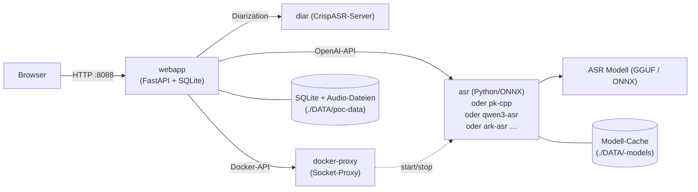

# PolySchnack — Multi-Backend Speech-to-Text

**OpenAI-kompatible Spracherkennung mit wählbaren ASR-Backends** — von lokalen
ggml/C++-Engines bis zur Cloud-API. Mit Web UI, Live-Transkription, Word-Timestamps,
Sprechererkennung (Diarization) und OIDC-per-Benutzer-Workspaces.


---

## Überblick

PolySchnack ist aus **[Parakeet ASR](https://github.com/nvidia/parakeet)** von
**NVIDIA** (ursprünglich [istupakov/parakeet-tdt](https://github.com/istupakov/parakeet-tdt))
entstanden und wurde **massiv erweitert**:

- **Multi-Backend-Architektur** — wähle zwischen Python/ONNX, parakeet.cpp (ggml/C++),
  Qwen3-ASR, ARK-ASR, Moonshine-DE und Canary — ohne Code-Änderung
- **Moderne Web UI** mit WaveSurfer-Wellenform, Zoom, Segment-Editor,
  Echtzeit-Vorschau, Export (SRT/VTT/TXT)
- **Word-Timestamps** via Forced Alignment (Qwen3-ASR) oder
  Modell-inhärent (Parakeet)
- **Docker Compose** — ein Befehl, alle Backends profilierbar

> **Danke an die ursprünglichen Autoren:** Das Projekt startete als Fork von
> [istupakov/parakeet-tdt](https://github.com/istupakov/parakeet-tdt) (NVIDIA Parakeet
> TDT 0.6B v3) und dessen WebUI. Seitdem kamen hinzu: Multi-Backend-Adapter,
> OIDC-Auth, Diarization, Sprachauswahl, Segment-Editor, WaveSurfer-Integration
> und eine modulare C++-Backend-Architektur.

---

## Features

- **OpenAI-kompatible API** — Drop-in für `openai.Audio.transcriptions.create()`
- **Multi-Backend** — `ASR_BACKEND=pk-python|pk-cpp|qwen3-asr|ark-asr|moonshine-de|canary-asr` per Env-Var
- **Word-Timestamps** — echte Word-Level-Timestamps via ForcedAligner (Qwen3-ASR)
- **Web UI** — Upload, Playback, Zoom, Crop, Segment-Edit, Export
- **Live Preview** — SSE Streaming zeigt Text chunkweise an
- **Long Audio** — überlappende Sliding-Windows (300 s + 15 s Overlap) mit
  VAD→Mel-Energy→Midpoint-Seam-Kaskade und Wort-Deduplizierung an Nähten
- **VAD** — Silero-VAD für Stille-Erkennung und Trimmung
- **Diarization** — Sprechererkennung via CrispASR-diar-Service (eigener Container, kein pyannote/CUDA-torch in der Webapp)
- **Noise Reduction** — spektrale Rauschunterdrückung
- **Multi-Language UI** — English · Deutsch · Português
- **OIDC Auth** — Per-Benutzer-Workspaces via Authentik, Keycloak uvm.
- **Duplicate Detection** — Blake2b-Hash verhindert doppelte Uploads
- **Auto-Retention** — Automatische Löschung öffentlicher Aufnahmen

---

## Quickstart

**Voraussetzung:** Docker mit Compose v2. Für GPU: NVIDIA Container Toolkit.

PolySchnack ist **hybrid**: Der Default-Stack läuft überall (CPU), mit einem
Overlay wird GPU-Zugriff aktiviert (ASR + Diarization).

```bash
git clone <dein-repo-url>
cd polyschnack

# Variante A — CPU (läuft überall, kein NVIDIA-Toolkit nötig):
docker compose up -d

# Variante B — GPU (RTX 3090 o.ä., NVIDIA Container Toolkit installiert):
docker compose -f compose.yml -f compose.gpu.yml up -d
```

- **Web UI:** http://localhost:8088
- **ASR API (direkt):** http://localhost:5092

**Wie Hybrid funktioniert (Weg 1):** Jeder Service ist EIN Image für GPU UND
CPU — die CUDA/ggml-Binaries enthalten den CPU-Backend und wählen automatisch
(`ggml_backend_init_best` = CUDA > Metal > Vulkan > CPU; approach-a nutzt
`POLYSCHNACK_USE_GPU=auto` mit onnxruntime-gpu). Mit GPU-Zugriff (Overlay
`compose.gpu.yml` → `runtime: nvidia`) läuft alles auf der GPU, ohne Overlay
automatisch auf der CPU. Es gibt keine separaten CPU-Container mehr.
Die **Diarization** läuft seit „Option B" im eigenen CrispASR-diar-Container
(`diar`, Port 8080) — ebenfalls hybrid. Die Webapp selbst ist **CPU-only**
(kein torch/pyannote im Image, ~2,5–3 GB schlanker).
Das Overlay ist die einzige Stelle, an der `runtime: nvidia` gesetzt wird —
ohne es startet der Stack auf jeder Maschine.

---

## Backend-Auswahl für Einsteiger

PolySchnack unterstützt **mehrere ASR-Engines**. Du wechselst einfach per
Env-Variable — kein Code nötig.

| Backend | Profil | CLI-Name | Beschreibung |
|---------|--------|----------|-------------|
| **Parakeet (Python/ONNX)** | *(Default)* | `pk-python` | Das Original-Modell von NVIDIA, 0,6B Parameter. Hybrid: GPU (CUDA) oder CPU (INT8), auto-detect. |
| **parakeet.cpp (ggml/C++)** | `--profile cpp` | `pk-cpp` | Gleiches Modell, aber in C++ — schneller und schlanker (~700 MB quantisiert). Seit Weg 1 eigenes hybrides CrispASR-Image (CUDA-Binary mit CPU-Fallback) statt externem mudler-Image; native Interpunktion + deutsches Truecasing. |
| **Qwen3-ASR (ggml/C++)** | `--profile qwen3` | `qwen3-asr` | Neuestes ASR-Modell von Alibaba, 30 Sprachen, **Word-Timestamps** via ForcedAligner (~3 GB beide Modelle). Hybrid. Native Interpunktion + deutsches Truecasing (Server-Flag). |
| **ARK-ASR (ggml/C++)** | `--profile ark` | `ark-asr` | State-of-the-Art auf dem HF ASR Leaderboard, 3B Parameter, Whisper-Encoder + Qwen2.5-Decoder. Hybrid (CrispASR-Binary). Native Interpunktion + deutsches Truecasing (Server-Flag). |
| **Moonshine-DE (ggml/C++)** | `--profile moonshine` | `moonshine-de` | Kompaktes deutsches Spezialmodell (61,5M Parameter, 6,9 % WER auf CV22-de, ~39 MB GGUF). Besonders schnell und ressourcenschonend. ⚠️ Lizenz CC-BY-NC-SA-4.0 (nicht-kommerziell). |
| **Canary (ggml/C++)** | `--profile canary` | `canary-asr` | NVIDIA Canary 1B v2 — multilingual (EN/DE/FR/ES). Hybrid (CrispASR-Binary). |
| **Voxtral (voxtral.cpp)** | *(geplant)* | `voxtral` | Mistral AI — Speech-to-Text, 4B Parameter, natives Streaming (1 Token je 80-ms-Audioframe). Läuft über [voxtral.cpp](https://github.com/andrijdavid/voxtral.cpp) (ggml/C++), Modell als GGUF (~2,7 GB Q4_K_M). **Noch nicht gebaut** — Block in `compose.backends.yml` ist auskommentiert. |

### Feature-Matrix der Backends

| Feature | pk-python | pk-cpp | qwen3-asr | ark-asr | moonshine-de | canary-asr | voxtral* |
|---------|-----------|--------|-----------|---------|-------------|------------|---------|
| Word-Timestamps | ✅ | ✅ | ✅ | ✅ | ✅ | ✅ | ❌ *nicht trainiert* |
| Live-Streaming (Preview) | ✅ | ❌ | ❌ | ❌ | ❌ | ❌ | ✅ |
| Async-Jobs (Hintergrund) | ✅ | ❌ | ❌ | ❌ | ❌ | ❌ | ❌ |
| Noise-Reduction (Service) | ✅ | ❌ | ❌ | ❌ | ❌ | ❌ | ❌ |
| VAD-Trimmung (Silero, extern) | ✅ | ✅ | ✅ | ✅ | ✅ | ✅ | ✅ |
| Diarization (CrispASR-diar, extern) | ✅ | ✅ | ✅ | ✅ | ✅ | ✅ | ✅ |
| Audio-Enhance (ffmpeg, extern) | ✅ | ✅ | ✅ | ✅ | ✅ | ✅ | ✅ |
| Deutsch (Hauptsprache) | ✅ | ✅ | ✅ | ✅ | ✅ (DE-Spezial) | ✅ | ✅ |
| Weitere Sprachen | EN u. a. | EN u. a. | 30 Sprachen | EN u. a. | — | EN/FR/ES | EN |
| Gerät | GPU + CPU | GPU + CPU | GPU + CPU | GPU + CPU | GPU + CPU | GPU + CPU | GPU |
| Modellgröße (Download) | ~2,4 GB | ~0,7 GB | ~3 GB | ~3,2 GB | ~39 MB | ~0,5 GB | ~2,7 GB |

*Voxtral ist **geplant** (Block in `compose.backends.yml` auskommentiert, kein Image gebaut) —
die Zeile zeigt die Zielwerte. Die Matrix ist auch live in der GUI
(Admin-Bereich → „Modell-Matrix") und via `GET /api/models/matrix` abrufbar.*

### Parakeet (Python/ONNX) — Standard, einfach loslegen

```bash
docker compose up -d
```

Das ASR-Modell (~600 MB) wird beim ersten Start von HuggingFace geladen.
Keine Konfiguration nötig. Läuft auf CPU oder GPU.

### parakeet.cpp — schneller und schlanker

```bash
CPP_URL=http://polyschnack-cpp:8080 ASR_BACKEND=pk-cpp \
  docker compose -f compose.yml -f compose.backends.yml --profile cpp up -d
```

Das GGUF-Modell (~700 MB) muss einmalig geladen werden:
```bash
docker run --rm -v "$PWD/DATA/cpp-models:/models" alpine wget -O /models/parakeet-tdt-0.6b-v3-q8_0.gguf \
  https://huggingface.co/cstr/parakeet-tdt-0.6b-v3-GGUF/resolve/main/parakeet-tdt-0.6b-v3-q8_0.gguf
```

> **Achtung:** `CPP_URL` ist die **eigene** Env-Variable des pk-cpp-Adapters —
> nicht `ASR_URL` verwenden (das ist der ONNX-pk-python-Container).

### Qwen3-ASR — beste Spracherkennung + Word-Timestamps

```bash
QWEN3_URL=http://qwen3-asr:8080 ASR_BACKEND=qwen3-asr \
  docker compose -f compose.yml -f compose.backends.yml --profile qwen3 up -d
```

Zwei Modelle (~3 GB): ASR (Q8_0) + ForcedAligner (F16) müssen geladen werden:
```bash
docker run --rm -v "$PWD/DATA/qwen3-models:/models" alpine sh -c '
  wget -qO /models/qwen3-asr-0.6b-q8_0.gguf \
    https://huggingface.co/OpenVoiceOS/qwen3-asr-0.6b-q8-0/resolve/main/qwen3-asr-0.6b-q8_0.gguf &&
  wget -qO /models/qwen3-forced-aligner-0.6b-f16.gguf \
    https://huggingface.co/OpenVoiceOS/qwen3-forced-aligner-0.6b-f16/resolve/main/qwen3-forced-aligner-0.6b-f16.gguf
'
```

### ARK-ASR — State-of-the-Art Erkennung

```bash
CRISPASR_URL=http://ark-asr:8080 ASR_BACKEND=ark-asr \
  docker compose -f compose.yml -f compose.backends.yml --profile ark up -d
```

Das GGUF-Modell (~4 GB, Q8_0) muss einmalig geladen werden:
```bash
docker run --rm -v "$PWD/DATA/ark-models:/models" alpine wget -O /models/ark-asr-3b-q8_0.gguf \
  https://huggingface.co/cstr/ark-asr-3b-GGUF/resolve/main/ark-asr-3b-q8_0.gguf
```

### Moonshine-DE — kompaktes Deutsches Spezialmodell

```bash
ASR_BACKEND=moonshine-de \
  docker compose -f compose.yml -f compose.backends.yml --profile moonshine up -d
```

Modell + Tokenizer (~42 MB) müssen einmalig geladen werden:
```bash
docker run --rm -v "$PWD/DATA/moonshine-models:/models" alpine sh -c '
  wget -qO /models/moonshine-base-de-fidoriel-q4_k.gguf \
    https://huggingface.co/cstr/moonshine-base-de-fidoriel-GGUF/resolve/main/moonshine-base-de-fidoriel-q4_k.gguf &&
  wget -qO /models/tokenizer.bin \
    https://huggingface.co/cstr/moonshine-base-de-fidoriel-GGUF/resolve/main/tokenizer.bin
'
```

> ⚠️ **Lizenz:** CC-BY-NC-SA-4.0 — nicht für kommerzielle Nutzung.

### Canary — multilingual (EN/DE/FR/ES)

```bash
ASR_BACKEND=canary-asr \
  docker compose -f compose.yml -f compose.backends.yml --profile canary up -d
```

Das Modell (~0,6 GB, q4_K) muss einmalig geladen werden:
```bash
docker run --rm -v "$PWD/DATA/canary-models:/models" alpine wget -O /models/canary-1b-v2-q4_k.gguf \
  https://huggingface.co/cstr/canary-1b-v2-GGUF/resolve/main/canary-1b-v2-q4_k.gguf
```

### Diarization (Sprechererkennung) — CrispASR-diar-Service

Die Diarization läuft seit „Option B" **nicht mehr in der Webapp** (kein
pyannote, kein CUDA-torch), sondern im eigenen `diar`-Container — einem
schlanken CrispASR-Server, der nur für die Sprechererkennung zuständig ist
und unabhängig vom gewählten ASR-Backend funktioniert:

- **Im Default-Stack enthalten** (`compose.yml` → `diar`), Healthcheck aktiv
- **GPU** via Overlay (`compose.gpu.yml` → `runtime: nvidia`), sonst CPU (ggml)
- Kein HF_TOKEN nötig — die Webapp ruft nur `POST /v1/audio/transcriptions`
  mit `diarize=true&response_format=diarized_json` auf

Das Modell (parakeet-GGUF, ~470 MB) muss einmalig geladen werden:
```bash
docker run --rm -v "$PWD/DATA/diar-models:/models" alpine wget -O /models/parakeet-tdt-0.6b-v3-q8_0.gguf \
  https://huggingface.co/cstr/parakeet-tdt-0.6b-v3-GGUF/resolve/main/parakeet-tdt-0.6b-v3-q8_0.gguf
```

Die Methode ist per `DIARIZE_METHOD` wählbar (Webapp-Env): `pyannote`
(Default, GGUF-Port des bekannten Modells), `foxnose` (WeSpeaker-ResNet34,
laut CrispASR beste Accuracy, keine externen deps), `energy`/`xcorr`/
`vad-turns` (leichtgewichtig). Die „Sprecheranzahl" aus der UI wird als
`diarize_max_speakers` übertragen.

---

## Compose-Referenz (Datei-Split)

Der Stack ist bewusst in **drei Compose-Dateien** aufgeteilt — jede hat eine
einzige Aufgabe:

- **`compose.yml` (Main)** — Kern-Stack: `docker-proxy` (Socket-Proxy für die
  Admin-Steuerung), `asr` (Parakeet Python/ONNX), `diar` (CrispASR-Diarization)
  und `webapp` (GUI). Wird von `docker compose up` automatisch geladen.
- **`compose.backends.yml`** — die optionalen Backends `asr-cpp`, `qwen3-asr`,
  `ark-asr` (Voxtral: geplant), jeweils über **Docker-Profile** aktivierbar.
- **`compose.gpu.yml`** — GPU-Overlay (`runtime: nvidia` für alle hybriden
  Services). Nur auf Maschinen mit NVIDIA Container Toolkit einbinden;
  ohne Overlay laufen alle Container automatisch auf der CPU.

**Warum Profile statt `docker-compose.override.yml`?** Eine Override-Datei wird
von Compose **immer automatisch gemergt** — die Backends wären dauerhaft Teil
des Stacks. Profile halten sie optional: definiert, aber nur gestartet, wenn
`--profile <name>` gesetzt wird. Die Admin-GUI kann die (per `--no-start`
erzeugten) Container trotzdem on demand starten/stoppen.

**Warum GPU als Overlay statt hardcodiert?** `runtime: nvidia` in der
Main-Compose würde den Stack auf Maschinen ohne NVIDIA-Runtime unstartbar
machen. Das Overlay ist die einzige Stelle, an der GPU-Zugriff vergeben wird —
ohne Datei läuft alles auf CPU, mit Datei auf GPU (CUDA/ggml-Fallback).

```bash
# Nur Kern (GUI + ONNX, CPU oder GPU via Overlay):
docker compose up -d                                   # CPU
docker compose -f compose.yml -f compose.gpu.yml up -d # GPU

# Kern + Backends (Container erzeugen, GUI startet on demand):
docker compose -f compose.yml -f compose.backends.yml \
  --profile cpp --profile qwen3 --profile ark up -d --no-start

# Kern + einzelnes Backend direkt mitstarten:
docker compose -f compose.yml -f compose.backends.yml --profile cpp up -d
```

Die folgenden YAML-Ausschnitte zeigen die Services im Überblick
(`asr`, `diar`, `webapp`, `docker-proxy` in `compose.yml`; die optionalen
Backends in `compose.backends.yml`):

```yaml
services:
  # ──────────────────────────────────────────────────
  # Kern-Stack (compose.yml) — läuft überall (CPU),
  # GPU nur via compose.gpu.yml-Overlay (runtime: nvidia)
  # ──────────────────────────────────────────────────
  docker-proxy:
    image: tecnativa/docker-socket-proxy:latest
    environment:
      CONTAINERS: "1"   # GET/POST /containers/* (start/stop/restart/logs)
      INFO: "1"         # GET /info (Host-RAM/CPU für den Ressourcen-Check)
      POST: "1"         # POST-Aktionen erlauben
    volumes:
      - /var/run/docker.sock:/var/run/docker.sock:ro

  asr:                  # Parakeet Python/ONNX (Default-Backend)
    image: registry.example.com/public/polyschnack-asr:latest
    container_name: polyschnack-asr
    environment:
      POLYSCHNACK_USE_GPU: "auto"   # GPU wenn verfügbar, sonst CPU-INT8
      POLYSCHNACK_DEFAULT_MODEL: istupakov/parakeet-tdt-0.6b-v3-onnx
    ports: ["5092:5092"]
    volumes: ["./DATA/parakeet-models:/app/models"]

  diar:                 # Diarization (CrispASR-Server, Option B)
    image: registry.example.com/public/polyschnack-asr-diar:latest
    container_name: polyschnack-diar
    environment:
      DIAR_MODEL: /models/parakeet-tdt-0.6b-v3-q8_0.gguf
    volumes: ["./DATA/diar-models:/models:ro"]
    healthcheck: { test: ["CMD", "curl", "-f", "http://localhost:8080/health"] }

  webapp:
    image: registry.example.com/public/polyschnack-asr-webapp:latest
    container_name: polyschnack-webapp
    environment:
      ASR_URL: "${ASR_URL:-http://asr:5092}"
      ASR_BACKEND: "${ASR_BACKEND:-pk-python}"
      DIAR_URL: "${DIAR_URL:-http://diar:8080}"
      DIARIZE_METHOD: "${DIARIZE_METHOD:-pyannote}"
      DOCKER_PROXY_URL: http://docker-proxy:2375
      PUBLIC_RETENTION_MINUTES: "60"
    ports: ["8088:8080"]
    volumes: ["./DATA/poc-data:/data"]
    depends_on:
      asr: { condition: service_healthy }
      diar: { condition: service_started }

  # ──────────────────────────────────────────────────
  # Optionale Backends (compose.backends.yml, Docker-Profile)
  # Alle hybrid: CUDA-Binary mit CPU-Fallback (Weg 1),
  # GPU via compose.gpu.yml-Overlay, sonst automatisch CPU
  # ──────────────────────────────────────────────────
  asr-cpp:              # Profil: --profile cpp (Port 5093)
    image: registry.example.com/public/polyschnack-asr-cpp:latest
    container_name: polyschnack-cpp
    environment:
      CPP_ASR_MODEL: /models/parakeet-tdt-0.6b-v3-q8_0.gguf
      CRISPASR_EXTRA_ARGS: "--punc-model fullstop --truecase-model lstm"

  qwen3-asr:            # Profil: --profile qwen3 (Port 5094)
    image: registry.example.com/public/polyschnack-asr-qwen3:latest
    container_name: qwen3-asr
    environment:
      QWEN3_ASR_MODEL: /models/qwen3-asr-0.6b-q8_0.gguf
      QWEN3_ALIGNER_MODEL: /models/qwen3-forced-aligner-0.6b-f16.gguf
      CRISPASR_EXTRA_ARGS: "--punc-model fullstop --truecase-model lstm"

  ark-asr:              # Profil: --profile ark (Port 5095)
    image: registry.example.com/public/polyschnack-asr-ark:latest
    container_name: ark-asr
    environment:
      ARK_ASR_MODEL: /models/ark-asr-3b-q8_0.gguf
      CRISPASR_EXTRA_ARGS: "--punc-model fullstop --truecase-model lstm"

  moonshine-de:         # Profil: --profile moonshine (Port 5096)
    image: registry.example.com/public/polyschnack-asr-moonshine-de:latest
    container_name: polyschnack-moonshine-de
    environment:
      MOONSHINE_DE_MODEL: /models/moonshine-base-de-fidoriel-q4_k.gguf
      CRISPASR_EXTRA_ARGS: "--punc-model fullstop --truecase-model lstm"

  canary-asr:           # Profil: --profile canary (Port 5097)
    image: registry.example.com/public/polyschnack-asr-canary:latest
    container_name: polyschnack-canary
    environment:
      CANARY_ASR_MODEL: /models/canary-1b-v2-q4_k.gguf
      CRISPASR_EXTRA_ARGS: "--punc-model fullstop --truecase-model lstm"
```

> **Hinweis:** Modell-Dateien liegen in Bind-Mounts unter `./DATA/<name>-models/`
> (keine Named-Volumes). Die `healthcheck`-Zeilen sind vereinfacht dargestellt —
> die vollständigen Definitionen stehen in `compose.yml` / `compose.backends.yml`.

### Profile im Detail

Alle Profile starten hybride Images (GPU via `-f compose.gpu.yml`-Overlay,
sonst automatisch CPU — kein manueller GPU/CPU-Wechsel):

| Profil | Befehl | Startet | GPU via Overlay |
|--------|--------|---------|:---------:|
| *(kein Profil)* | `docker compose up -d` | docker-proxy + asr + diar + webapp | ✅ |
| `--profile cpp` | `docker compose -f compose.yml -f compose.backends.yml --profile cpp up -d` | + asr-cpp | ✅ |
| `--profile qwen3` | `docker compose -f compose.yml -f compose.backends.yml --profile qwen3 up -d` | + qwen3-asr | ✅ |
| `--profile ark` | `docker compose -f compose.yml -f compose.backends.yml --profile ark up -d` | + ark-asr | ✅ |
| `--profile moonshine` | `docker compose -f compose.yml -f compose.backends.yml --profile moonshine up -d` | + moonshine-de | ✅ |
| `--profile canary` | `docker compose -f compose.yml -f compose.backends.yml --profile canary up -d` | + canary-asr | ✅ |

Das Backend wird über die Adapter-Auswahl gesteuert — **jeder Adapter hat
seine eigene URL-Env** (nie `ASR_URL` für andere Backends verwenden — das ist
der ONNX-pk-python-Container!):

| Variable | Default | Beschreibung |
|----------|---------|-------------|
| `ASR_BACKEND` | `pk-python` | Adapter-Auswahl (`pk-python`, `pk-cpp`, `qwen3-asr`, `ark-asr`, `moonshine-de`, `canary-asr`) |
| `ASR_URL` | `http://asr:5092` | URL des ONNX-pk-python-Containers |
| `CPP_URL` | `http://polyschnack-cpp:8080` | URL des pk-cpp-Containers (CrispASR parakeet) |
| `QWEN3_URL` | `http://qwen3-asr:8080` | URL des Qwen3-ASR-Containers |
| `CRISPASR_URL` | `http://ark-asr:8080` | URL des ARK-ASR-Containers (CrispASR) |
| `MOONSHINE_URL` | `http://polyschnack-moonshine-de:8080` | URL des Moonshine-DE-Containers |
| `CANARY_URL` | `http://polyschnack-canary:8080` | URL des Canary-Containers |

```bash
# WICHTIG: ASR_BACKEND IMMER explizit setzen — ohne Adapter-Auswahl fällt
# get_client() still auf pk-python zurück und postet gegen den ONNX-Container!
QWEN3_URL=http://qwen3-asr:8080 ASR_BACKEND=qwen3-asr docker compose -f compose.yml -f compose.backends.yml --profile qwen3 up -d

# Kombination mehrerer Backends (Admin-GUI startet sie on demand):
docker compose -f compose.yml -f compose.backends.yml \
  --profile cpp --profile qwen3 --profile ark up -d --no-start
```

---

## Architektur



Die Webapp kommuniziert mit den ASR-Backends über die OpenAI-kompatible
`POST /v1/audio/transcriptions`-Schnittstelle. Der Adapter wird durch die
Umgebungsvariable `ASR_BACKEND` gesteuert (jedes Backend hat seine eigene
URL-Env — siehe Env-Tabelle oben). Die Diarization läuft im eigenen
`diar`-Container (CrispASR-Server, `POST /v1/audio/transcriptions` mit
`diarize=true&response_format=diarized_json`). Die Admin-GUI steuert die
Backend-Container über den restriktiven `docker-proxy` (kein direkter
Docker-Socket-Zugriff aus der Webapp).

---

## Web UI Features

### Upload & Transcribe

1. **Datei hochladen** — Drag & Drop oder Klick (MP3, WAV, OGG, OPUS, M4A, FLAC, WEBM)
2. **▶ Transkribieren** — die Feature-Toggles (VAD, Diarization, Noise Reduction, Live, Enhance) und das Backend docken direkt an der Zeile an, auf der du transkribierst
3. **Transcribe-Queue** — mehrere Transkriptionen werden pro Backend serialisiert (Kapazität je Endpunkt = 1); Position und ETA zeigt der Queue-Watcher
4. **Wellenform + Zoom** — WaveSurfer mit Zoom (1×–50×)
5. **Bereich wählen** — blauen Griff ziehen, um nur einen Ausschnitt zu transkribieren
6. **Re-transkribieren** — Klick auf „Re-transcribe" klappt die Feature-Auswahl an der Zeile auf und wird zum ▶-Button (ohne Bestätigungsdialog)
7. **Playback** — Klick auf Segment zum Abspielen

### Weitere Features

- **Segment-Editor** — Doppelklick auf Text, `Ctrl+Enter` speichert
- **Export** — SRT, VTT, TXT (mit Sprecher-Labels wenn Diarization aktiv)
- **Duplicate Detection** — gleiche Datei erkennen und überspringen
- **Auto-Retention** — öffentliche Aufnahmen nach 60 Minuten löschen

---

## Konfiguration

### ASR-Backend wählen

| Variable | Werte | Default |
|----------|-------|---------|
| `ASR_BACKEND` | `pk-python`, `pk-cpp`, `qwen3-asr`, `ark-asr`, `moonshine-de`, `canary-asr` | `pk-python` |
| `ASR_URL` | URL des ONNX-Dienstes | `http://asr:5092` |
| `POLYSCHNACK_DEFAULT_BACKEND` | wie `ASR_BACKEND` (Default für neue Jobs, per Admin-GUI änderbar) | `pk-python` |

### Webapp-Umgebungsvariablen

| Variable | Default | Beschreibung |
|----------|---------|-------------|
| `ASR_URL` | `http://asr:5092` | ASR-Service-URL |
| `ASR_BACKEND` | `pk-python` | Welcher Adapter |
| `VAD_TRIM_SILENCE` | `false` | Stille-Trimmung aktivieren |
| `DIAR_URL` | `http://diar:8080` | Diarization-Service (CrispASR-diar-Container) |
| `DIARIZE_METHOD` | `pyannote` | Diarization-Methode im CrispASR-Server (`pyannote`\|`foxnose`\|`energy`\|…) — per Recording über das GUI-Dropdown „Methode" überschreibbar |
| `PUBLIC_RETENTION_MINUTES` | `60` | Auto-Löschung öffentl. Aufnahmen |
| `OIDC_CLIENT_ID` | `""` | OIDC-Client-ID (leer = kein Auth) |
| `OIDC_ISSUER` | `""` | OIDC-Issuer-URL |
| `SESSION_SECRET` | auto | Session-Key |
| `BASE_URL` | `http://localhost:8088` | Externe URL für OIDC-Redirects |
| `POLYSCHNACK_ADMINS` | `""` | Komma-Liste (OIDC-sub oder E-Mail) mit Admin-Rechten (Service-Start/Stop, Backend-Wechsel) |
| `POLYSCHNACK_ADMIN_GROUPS` | `""` | Komma-Liste von OIDC-Gruppen mit Admin-Rechten |
| `DOCKER_PROXY_URL` | `http://docker-proxy:2375` | Restriktiver Docker-Socket-Proxy (Services on demand starten/stoppen) |
| `POLYSCHNACK_MAX_QUEUE_LEN` | `20` | Maximale Jobs in der Transcribe-Queue |

---

## OIDC-Auth (optional)

Ohne OIDC läuft PolySchnack als **Shared Space**: jede\*r kann hochladen und
transkribieren, alles ist öffentlich und wird nach `PUBLIC_RETENTION_MINUTES`
automatisch gelöscht.

Mit OIDC bekommt jede\*r eingeloggte User einen **privaten Workspace** (eigene
Aufnahmen, fremde unsichtbar). Der Admin-Bereich (Service-Start/Stop,
Backend-Wechsel) setzt OIDC zwingend voraus — ohne Login gibt es keine Admins.

Aktivierung in der Webapp-Umgebung:

| Variable | Beispiel | Bedeutung |
|----------|----------|-----------|
| `OIDC_CLIENT_ID` | `polyschnack` | Client-ID beim Identity Provider |
| `OIDC_CLIENT_SECRET` | `…` | Client-Secret beim IdP (Confidential Client) |
| `OIDC_ISSUER` | `https://auth.example.com` | Issuer-URL (Keycloak, Authentik, …) — **OIDC ist aktiv, sobald Client-ID + Issuer gesetzt sind** |
| `OIDC_SCOPE` | `openid profile email` | Standard; `email` wird benötigt, wenn Admins per E-Mail matchen sollen |
| `SESSION_SECRET` | zufälliger langer String | Signiert die Session-Cookies — **unbedingt setzen**, sonst ist die Session-Auth wertlos |
| `BASE_URL` | `https://polyschnack.example.com` | Externe URL der App; **der OIDC-Redirect läuft immer hierhin** |

**Einmalig beim IdP registrieren:**
- Redirect-URI: `https://<BASE_URL>/auth/callback` (exakt, ohne Trailing-Slash)
- Flow: Authorization Code + PKCE (Confidential Client)
- Damit `is_admin` per Gruppe matchen kann, muss der IdP die Gruppen als
  `groups`-Claim im Userinfo liefern (Keycloak: Gruppen-Mapper am Client;
  Authentik: `groups` ist im Userinfo enthalten)

**Login-Ablauf:** `GET /auth/login` → Redirect zum IdP → `GET /auth/callback`
(setzt Session, speichert `is_admin`) → zurück zur App. `GET /auth/logout`
löscht die Session.

**Eigene User-ID finden:** eingeloggt `GET /auth/me` aufrufen → Antwort zeigt
`sub`, `email`, `name` und ob `is_admin` bereits greift.

**Admins designieren** (für den Admin-Bereich):
- `POLYSCHNACK_ADMINS` — Komma-Liste von `sub`-IDs **oder** E-Mails
- `POLYSCHNACK_ADMIN_GROUPS` — Komma-Liste von OIDC-Gruppennamen

### Admin-Rechte im Detail

Beide Env-Variablen wirken **unabhängig voneinander** (ODER-Verknüpfung) — wer
über einen der beiden Wege matcht, ist Admin:

1. **`POLYSCHNACK_ADMINS` (sub/email-Liste):** Beim Login wird der User in der
   DB angelegt bzw. aktualisiert (`sub`, `email`, `name`). Der Check vergleicht
   `user.sub` und `user.email` exakt gegen die Komma-Liste.
2. **`POLYSCHNACK_ADMIN_GROUPS` (Gruppen):** Beim Login holt die App die
   Userinfo vom IdP (`GET {issuer}/userinfo` mit dem Access-Token). Der Check
   bildet die Schnittmenge aus `userinfo["groups"]` (Liste von Strings) und der
   Komma-Liste. Ist sie nicht leer → Admin.

Wichtig für den Gruppen-Weg:
- Die Gruppen müssen im **Userinfo** unter dem Schlüssel `groups` liegen.
  Keycloak: Gruppen-Mapper am Client/Client-Scope einrichten (oft als Pfade
  wie `/admins` — exakt so eintragen). Authentik: `groups` ist standardmäßig
  im Userinfo enthalten.
- Liefert der Provider die Gruppen unter einem anderen Schlüssel
  (z. B. `realm_access.roles`), matchen sie nicht — dann den Mapper anpassen
  statt einen anderen Env-Namen zu erfinden.

**Zeitpunkt & Gültigkeit:** `is_admin` wird einmalig beim Login berechnet und
in der Session gecacht. Nach einer Änderung von `POLYSCHNACK_ADMINS` /
`POLYSCHNACK_ADMIN_GROUPS` muss sich der User daher **neu einloggen**
(Logout → Login; ein Webapp-Neustart allein reicht nicht). Ohne aktives OIDC
liefert `require_admin` immer 403 — der Admin-Bereich existiert nur mit
OIDC-Login, nie im Shared Space.

---

## Admin-Bereich

Der Admin-Bereich (`🛠 Admin` in der GUI, nur sichtbar für Admins) steuert die
ASR-Services on demand — die Webapp spricht dafür **niemals direkt** den
Docker-Socket an, sondern den restriktiven Proxy-Container
[`tecnativa/docker-socket-proxy`](https://github.com/Tecnicality/docker-socket-proxy)
(es sind nur die Container-/Info-Routen + POST freigeschaltet; Exec/Create/Events
bleiben deaktiviert).

- **Services** — Liste aller Backends mit Live-Status, Modell, Ressourcen-Report
  (VRAM/RAM/Disk), aktiven Jobs und Start/Stop/Neustart. Ein Stop ist **nur
  ohne laufende Jobs** auf dem Backend möglich (sonst 409 mit Anzahl).
- **Ressourcen-Check vor Start** — bevor ein Container startet, wird geprüft,
  ob genug RAM/Disk frei sind (VRAM exakt nur bei eigenen Servern über deren
  `/health`; bei Fremd-Images eine Warnung statt Blockade). Bei Mangel: 409 mit
  Report — kein Startversuch.
- **Config** — Default-Backend für neue Transkriptionen. Ein Wechsel auf ein
  nicht-laufendes Backend startet es automatisch (nach Ressourcen-Check),
  persistiert in `DATA_DIR/config.json`. Bereits laufende/gewartete
  Transkriptionen behalten ihr Backend bis zum Ende.
- **Modell-Matrix** — Feature-Übersicht aller Backends (Word-Timestamps,
  Streaming, Sprachen, Ressourcenbedarf …), auch als `GET /api/models/matrix`.

**Concurrency** ist bewusst **nicht** konfigurierbar: Jeder Endpunkt hat eine
Kapazität (selbstgehostete Services = 1), die Gesamt-Kapazität ist die Summe
der verfügbaren Endpunkte. Die Queue (`GET /api/queue`) zeigt eigene Jobs mit
Position/ETA, fremde Jobs anonymisiert (nur `#id`).

**Einmaliger Setup-Befehl** (erstellt alle Container, startet aber nichts —
die GUI startet dann on demand):

```
docker compose -f compose.yml -f compose.backends.yml --profile cpp --profile qwen3 --profile ark --profile moonshine --profile canary up -d --no-start
```

---

## Post-Processing & Delivery (nach der Transkription)

Alles ist **opt-in** (nichts läuft automatisch): an der Transcribe-Zeile wählst
du pro Aufnahme, was nach der Transkription passieren soll.

- **Satzzeichen (`✍️ Punct`)** — Interpunktion nach der Erkennung. Modus per
  `POLYSCHNACK_PUNCTUATION_MODE` (Default `off`; `local` = offline, `llm` =
  kostenpflichtig über den LLM-Endpunkt). **Achtung:** Die CrispASR-Backends
  (Qwen3-ASR, ARK-ASR, pk-cpp) punktieren **nativ** vom Server
  (`--punc-model fullstop` = EN/DE/FR/IT, `--truecase-model lstm` =
  deutsches Truecasing, 97,9 % F1) — dort wird das LLM-Punctuation
  automatisch übersprungen (keine doppelte Interpunktion).
- **Wort-Confidence (Per-Token)** — CrispASR-Backends liefern pro Wort eine
  Sicherheit (`probability` 0–100 %). Die Webapp färbt unsichere Wörter ein:
  **grün** ≥ 90 %, **gelb** ≥ 70 %, **rot** darunter — so findest du
  Fehlhörer auf einen Blick (nur sichtbar, wenn das Backend Confidence
  liefert; kein Fake-Wert).
- **LLM-Optimierung (`✨ LLM`)** — KI-Nachbearbeitung des Textes. **Nur für
  registrierte User** (kostenpflichtig), anonyme sehen den Schalter ausgegraut.
- **Vorlage (Template)** — eigene Prompt-Vorlagen im Panel `🧩 Post-Processing`
  verwalten (z. B. „Meeting-Zusammenfassung + ToDos"). Der Text ersetzt
  `{text}` im Prompt; das Ergebnis wird als **neue Version**
  (`kind="postprocess"`) abgelegt. Ebenfalls nur für registrierte User.
- **Senden an (Delivery-Target)** — fertige Transkription automatisch
  zustellen: **E-Mail** (SMTP) oder **WebDAV** (z. B. Nextcloud). Ziele werden
  im Panel angelegt; Passwörter werden **verschlüsselt** (Fernet, abgeleitet
  aus `SESSION_SECRET`) gespeichert und nie wieder ausgegeben. Auch für
  anonyme User nutzbar. Status (`pending`/`done`/`failed`) steht am Recording.

**Neue Umgebungsvariablen:**

| Variable | Default | Bedeutung |
|---|---|---|
| `POLYSCHNACK_PUNCTUATION_MODE` | `off` | `off` \| `local` \| `llm` |
| `POLYSCHNACK_DEFAULT_LLM_ENHANCE` | `false` | LLM-Optimierung default an |
| `POLYSCHNACK_LLM_URL` | *(leer)* | OpenAI-kompatibler Endpunkt (z. B. eigener LiteLLM-Proxy) |
| `POLYSCHNACK_LLM_API_KEY` | *(leer)* | API-Key für obigen Endpunkt |
| `POLYSCHNACK_LLM_MODEL` | `deepseek-chat` | Modellname |
| `POLYSCHNACK_SMTP_HOST` | *(leer)* | SMTP-Server (leer = Mail-Targets deaktiviert) |
| `POLYSCHNACK_SMTP_PORT` | `587` | SMTP-Port |
| `POLYSCHNACK_SMTP_USER` / `_PASS` | *(leer)* | SMTP-Login |
| `POLYSCHNACK_SMTP_FROM` | *(leer)* | Absender-Adresse |

### BYOK — eigene LLM-Endpunkte (registrierte User)

Registrierte User (OIDC) können eigene OpenAI-kompatible Endpunkte hinterlegen
und sie pro Transkription für LLM-Optimierung/Vorlagen auswählen (Tab
„LLM-Endpunkte (BYOK)" im Panel `🧩 Post-Processing`, Select „LLM-Endpunkt" an
der Transcribe-Zeile). Priorität: **User-Endpunkt > Server-Env**.

- **Anlegen:** Name, Base-URL (z. B. `https://api.mistral.ai/v1`), API-Key, Modell.
  Der **API-Key wird Fernet-verschlüsselt** gespeichert (Schlüssel aus
  `SESSION_SECRET`) und **nie** in der GUI/API/Logs ausgegeben — er ist nur
  beim Speichern sichtbar; ohne neuen Key bleibt der alte erhalten (PUT).
- **Sicherheit (SSRF):** Beim Speichern wird die URL geprüft — nur http(s) und
  **öffentliche** Adressen. `localhost`, private Netze (10/8, 172.16/12,
  192.168/16, 127.0.0.0/8, ::1, Link-Local) und die Cloud-Metadata-IP
  (169.254.169.254) werden mit 422 abgelehnt.
- **Zugriff:** Nur der Ersteller sieht/ändert/löscht seine Endpunkte (owner-only).
  BYOK ist ein kostenpflichtiger Pfad → **anonyme User gesperrt** (403, Select
  ausgegraut). Endpunkte sind strikt User-privat (keine Admin-Einsicht).

---

## Entwicklung

### Spezifikation (OpenSpec)

Die App ist retroaktiv in [OpenSpec-Format](openspec/) spezifiziert:
`openspec/project.md` (Überblick + External Systems), `openspec/specs/*/spec.md`
(7 Capabilities mit Requirements/Scenarios) und `openspec/changes/*/proposal.md`
(5 Change-Proposals der Feature-Epochen). **Pflege:** Neue Features → neues
Change-Proposal + Spec-Abschnitt aktualisieren (gleicher Commit).

### Voraussetzungen

- [uv](https://docs.astral.sh/uv/) (Python Package Manager)
- Node.js 20+
- Docker mit Compose v2

### ASR Backend (approach-a)

```bash
cd approach-a
uv sync
uv run uvicorn polyschnack_service.main:app --reload --port 5092
```

### Web App

```bash
cd webapp/frontend
npm install
npm run dev              # Vite Dev Server auf :5173

# Zweites Terminal:
cd webapp
ASR_URL=http://localhost:5092 uv run uvicorn app.main:app --reload --port 8080
```

---

## License

[MIT](LICENSE) — basiert auf [istupakov/parakeet-tdt](https://github.com/istupakov/parakeet-tdt)
(NVIDIA Parakeet TDT 0.6B v3) und [mudler/parakeet.cpp](https://github.com/mudler/parakeet.cpp).
