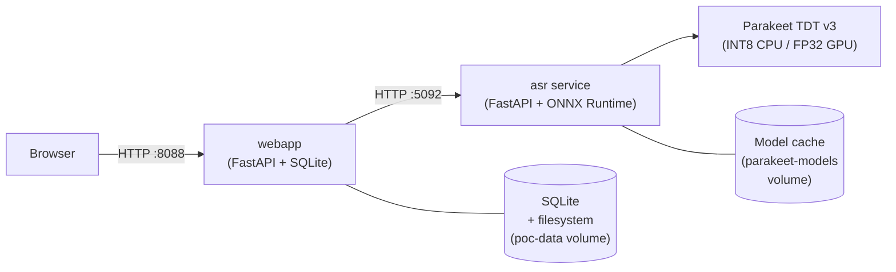
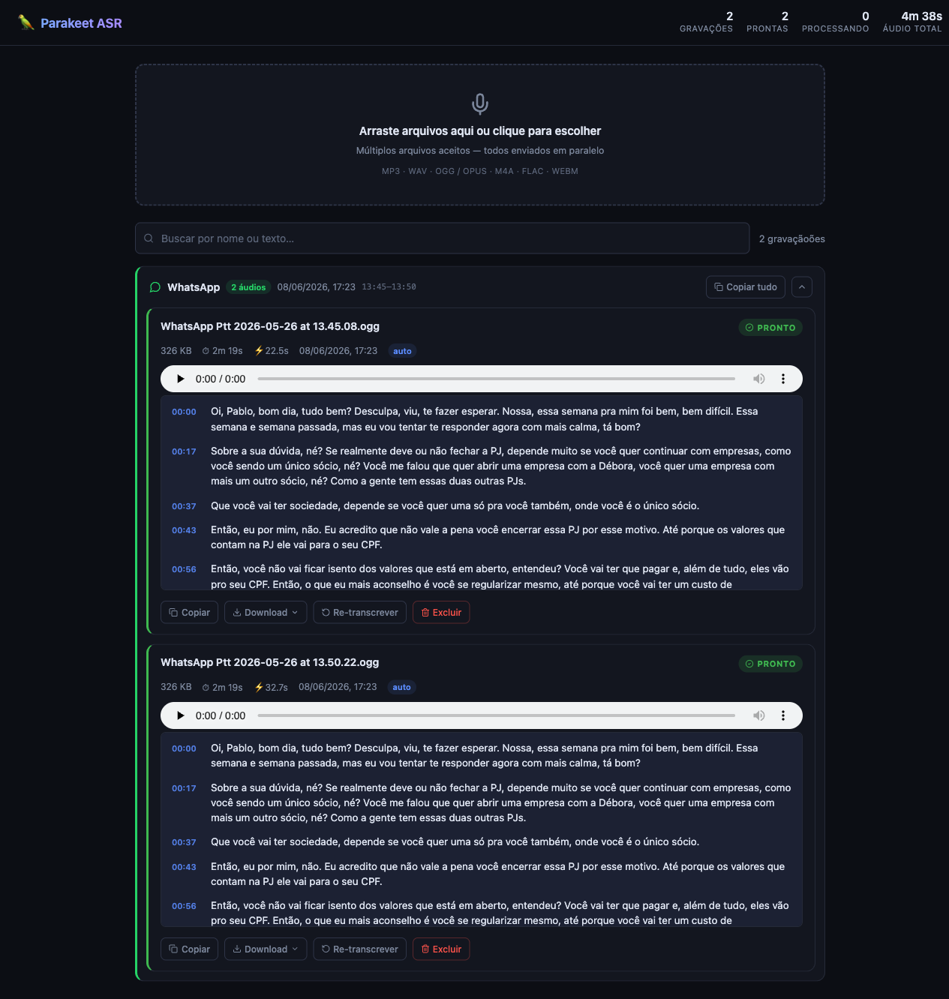

# Parakeet ASR Server

**OpenAI-compatible speech-to-text server powered by NVIDIA Parakeet TDT 0.6B v3 — with streaming, async jobs, and a web UI.**


---

## Features

- **OpenAI-compatible API** — drop-in replacement for `openai.Audio.transcriptions.create()` with no client changes
- **SSE streaming** — `POST /v1/audio/transcriptions/stream` sends incremental results as VAD chunks are processed
- **Async jobs** — `POST /v1/audio/transcriptions/async` + `GET /v1/audio/jobs/{id}` for long audio without HTTP timeouts
- **Web UI** — single-page interface: upload audio, trigger transcription, play audio, click timestamped segments, search transcriptions, export subtitles (SRT / VTT / TXT)
- **Persistent storage** — SQLite + filesystem (docker volume); survives container restarts
- **CPU and GPU docker images** — INT8 ONNX for CPU (arm64/x86), FP32/FP16 ONNX for NVIDIA GPU
- **Multilingual** — Parakeet TDT v3 covers English and many European languages including Portuguese
- **Metrics endpoint** — queue depth, request count, average and p95 latency

---

## Quickstart

**Requirements:** Docker with Compose v2. For GPU: NVIDIA Container Toolkit.

```bash
git clone <repo-url> parakeet-asr-server
cd parakeet-asr-server
docker compose up -d --build
```

- Web UI: http://localhost:8088
- ASR API (direct): http://localhost:5092

The ASR service downloads the INT8 ONNX model (~600 MB) on first boot into the
`parakeet-models` docker volume. Subsequent starts reuse the cache.

### curl

```bash
curl -s http://localhost:5092/health

curl -X POST http://localhost:5092/v1/audio/transcriptions \
  -F "file=@/path/to/audio.wav" \
  -F "model=parakeet-tdt-0.6b-v3" \
  -F "response_format=json" | jq .text
```

### Python (OpenAI client)

```python
from openai import OpenAI

client = OpenAI(
    api_key="not-used",
    base_url="http://localhost:5092/v1",
)

with open("audio.wav", "rb") as f:
    result = client.audio.transcriptions.create(
        model="parakeet-tdt-0.6b-v3",
        file=f,
    )
print(result.text)
```

---

## Architecture



Both services run as docker containers under a single `docker compose up`. The ASR service
is also usable standalone (port 5092 is exposed). The web app stores uploaded audio and
transcription records persistently and proxies transcription requests to the ASR service.

---

## API Reference

### ASR service (port 5092)

| Method | Path | Purpose |
|--------|------|---------|
| `POST` | `/v1/audio/transcriptions` | OpenAI-compat sync transcription. `response_format`: `json`, `text`, `srt`, `vtt`, `verbose_json` |
| `POST` | `/v1/audio/transcriptions/stream` | SSE streaming — one `data:` event per VAD chunk; last event has `"final": true` |
| `POST` | `/v1/audio/transcriptions/async` | Submit long audio — returns `202 {"job_id": "...", "status": "queued"}` |
| `GET` | `/v1/audio/jobs/{job_id}` | Poll job — `{"status": "queued\|processing\|done\|failed", "text": "..."}` |
| `POST` | `/v1/audio/transcriptions/batch` | Multi-file batch (non-OpenAI extension) |
| `GET` | `/health` | `{"status": "ok", "model": "...", "device": "cpu\|cuda"}` |
| `GET` | `/metrics` | `{"queue_depth", "total_requests", "total_errors", "avg_latency_ms", "p95_latency_ms"}` |

### Web app (port 8088)

| Method | Path | Purpose |
|--------|------|---------|
| `GET` | `/` | Single-page UI |
| `POST` | `/api/transcriptions` | Upload audio + trigger transcription; returns record with segments |
| `GET` | `/api/transcriptions` | List all transcription records (supports search query param) |
| `GET` | `/api/transcriptions/{id}` | Get single record with full segment data |
| `DELETE` | `/api/transcriptions/{id}` | Delete record and associated audio file |
| `GET` | `/api/transcriptions/{id}/audio` | Stream stored audio file |
| `GET` | `/api/transcriptions/{id}/export` | Download subtitle file (`?format=srt\|vtt\|txt`) |

---

## Configuration

### ASR service environment variables

| Variable | Default | Description |
|----------|---------|-------------|
| `PARAKEET_USE_GPU` | `true` | `true` / `false` / `auto` — force CPU even if CUDA is present |
| `PARAKEET_DEFAULT_MODEL` | `istupakov/parakeet-tdt-0.6b-v3-onnx` | Model key. CPU deployments use `parakeet-tdt-0.6b-v3` (INT8). See `config.py` for all model keys |
| `PARAKEET_INFER_WORKERS` | `1` (set in compose) | Parallel chunk inference threads. Keep at `1` on hosts with ≤3 GB RAM to avoid OOM — each worker loads the full model working set |
| `PARAKEET_CHUNK_TARGET_SEC` | `60` (compose: `20`) | Target VAD chunk length in seconds |
| `PARAKEET_CHUNK_MAX_SEC` | `75` (compose: `25`) | Hard cap per chunk. Lowering this reduces peak inference memory at the cost of more stitching |
| `PARAKEET_CHUNK_MIN_SEC` | `20` (compose: `10`) | Minimum chunk length before a silence boundary is forced |
| `PARAKEET_GPU_DEVICE_ID` | `0` | CUDA device index |
| `PARAKEET_VAD_THRESHOLD` | `0.5` | Silero-VAD speech probability threshold |
| `LOG_LEVEL` | `INFO` | Logging verbosity |

> **Memory note (CPU / low-RAM hosts):** The default `docker-compose.yml` ships conservative
> caps (`INFER_WORKERS=1`, `CHUNK_MAX_SEC=25`) validated on a 2-CPU / 2.8 GiB Docker VM
> (Apple M1 Pro). The process is silently OOM-killed without these limits when a long audio
> creates a large ORT activation sequence. On a bigger host relax these freely.
> See [`approach-a/POC_NOTES.md`](approach-a/POC_NOTES.md) for the full analysis.

### Web app environment variables

| Variable | Default | Description |
|----------|---------|-------------|
| `ASR_URL` | `http://asr:5092` | Base URL of the ASR service (no trailing slash) |
| `ASR_MODEL` | `parakeet-tdt-0.6b-v3` | Model name forwarded in every transcription request |
| `DATA_DIR` | `/data` | Root directory for SQLite DB and audio files inside the container |

---

## Development

### Prerequisites

- [uv](https://docs.astral.sh/uv/) (Python package manager)
- Docker with Compose v2

### ASR service (approach-a)

```bash
cd approach-a
uv sync
uv run uvicorn parakeet_service.main:app --reload --port 5092
```

### Web app

```bash
cd webapp
uv sync
uv run uvicorn app.main:app --reload --port 8080
```

The webapp expects the ASR service running at `ASR_URL` (default: `http://asr:5092`).
Set `ASR_URL=http://localhost:5092` for local dev outside docker.

### Generate test audio fixtures

```bash
cd approach-a
uv sync
uv run python scripts/gen_test_audio.py
# Writes: ../tests/audio/short_10s.wav, medium_60s.wav, long_30min.wav (+ .txt refs)
```

### Run benchmarks (Approach A)

```bash
cd approach-a
# ASR service must be running (docker or local)
uv run python benchmark.py --runs 5 --concurrency 5
# Output: ../results/approach-a.json + approach-a.md
```

---

## GPU Deployment

Use `Dockerfile.gpu` (already referenced as the `parakeet-gpu` service) and ensure
[NVIDIA Container Toolkit](https://docs.nvidia.com/datacenter/cloud-native/container-toolkit/install-guide.html)
is installed on the host.

```bash
# Start only the GPU variant of the ASR service + webapp
docker compose up -d --build parakeet-gpu webapp
```

**4 GB VRAM caveat:** GPU validation is pending (see [Benchmarks](#benchmarks)). The FP32
default model (`istupakov/parakeet-tdt-0.6b-v3-onnx`) may not fit in 4 GB. If you hit OOM,
switch to `grikdotnet/parakeet-tdt-0.6b-fp16` (FP16) via `PARAKEET_DEFAULT_MODEL` or fall
back to INT8 CPU mode. Verify with `nvidia-smi` and check `docker logs poc-asr`.

---

## Project Structure

```
parakeet-asr-server/
├── docker-compose.yml          # Unified stack: asr + webapp
├── RESULTS.md                  # Benchmark results + acceptance criteria
├── approach-a/                 # ASR service (Python/FastAPI + ONNX)
│   ├── Dockerfile.cpu
│   ├── Dockerfile.gpu
│   ├── parakeet_service/
│   │   ├── main.py             # FastAPI app + lifespan
│   │   ├── routes.py           # All endpoints
│   │   ├── core.py             # Shared decode → chunk → infer → stitch
│   │   ├── jobs.py             # Async job queue + in-memory store
│   │   ├── metrics.py          # Thread-safe counters
│   │   ├── model.py            # ONNX model loader
│   │   ├── chunker.py          # VAD-based audio chunking (Silero)
│   │   ├── audio.py            # Audio decode/resample helpers
│   │   ├── batchworker.py      # GPU micro-batch worker
│   │   └── config.py           # Env-driven configuration
│   ├── scripts/
│   │   └── gen_test_audio.py   # Generate synthetic test fixtures (gTTS)
│   ├── benchmark.py            # Latency / throughput / WER benchmark
│   └── POC_NOTES.md            # Implementation notes + CPU memory analysis
├── webapp/                     # Web UI (FastAPI + SQLModel + SQLite)
│   ├── Dockerfile
│   └── app/
│       ├── main.py             # FastAPI app
│       ├── models.py           # SQLModel table definitions
│       ├── crud.py             # DB operations (crud layer)
│       ├── db.py               # SQLite engine + session factory
│       ├── asr_client.py       # httpx client for the ASR service
│       ├── config.py           # Env-driven settings
│       └── static/index.html   # Single-page vanilla JS UI
├── tests/
│   └── audio/                  # Generated WAV fixtures + reference transcripts
├── results/                    # Benchmark outputs (JSON + Markdown)
│   ├── approach-a.json
│   └── approach-a.md
├── dist/                       # Built/released artifacts (see dist/README.md)
└── docs/
    └── img/                    # Screenshots (add ui.png here)
```

---

## Benchmarks

Validated on CPU only (Apple M1 Pro, Docker VM — 2 CPUs / 2.8 GiB, INT8 model). GPU
numbers are deferred pending access to a Linux NVIDIA box.

| Fixture | Audio duration | p50 | p95 | RTF |
|---------|---------------|-----|-----|-----|
| short_10s.wav | 14.4 s | 2.09 s | 2.62 s | 0.14 |
| medium_60s.wav | 64.3 s | 8.31 s | 9.24 s | 0.13 |
| long_30min.wav (async) | 1800 s | — | — | ~0.11 |

- WER on synthetic gTTS fixtures: 0.037 (short), 0.070 (medium) — inflated by
  case/punctuation mismatch; real WER is lower.
- Throughput (5 concurrent, short clip, serialized 1 worker): 0.75 req/s.
- 30-min async job: completed in ~231 s wall time, peak RAM ~1.3 GiB, no crash.

Full raw data: [`results/approach-a.json`](results/approach-a.json) — [`RESULTS.md`](RESULTS.md).

---

## Roadmap

- [ ] **Approach B** — Rust + Axum + [sherpa-onnx](https://github.com/k2-fsa/sherpa-onnx): lower latency, smaller image, WebSocket streaming
- [ ] **Approach C** — Python + NeMo direct: WER ground truth + latency baseline
- [ ] GPU validation on NVIDIA 4 GB VRAM (RTX 3050/4050 mobile)
- [ ] Comparative benchmark table (A vs B vs C)
- [ ] Real-audio WER evaluation (beyond synthetic gTTS)
- [ ] Streaming with true sub-second first-token latency (GPU path)

---

## Screenshot



*Upload audio, play it back, click any `[mm:ss]` segment to seek, search transcriptions, export SRT/VTT/TXT.*

---

## Credits

- [NVIDIA NeMo / Parakeet TDT 0.6B v3](https://huggingface.co/nvidia/parakeet-tdt-0.6b-v3) — the ASR model
- [groxaxo/parakeet-tdt-0.6b-v3-fastapi-openai](https://github.com/groxaxo/parakeet-tdt-0.6b-v3-fastapi-openai) — base FastAPI server that `approach-a` was adapted from
- [k2-fsa/sherpa-onnx](https://github.com/k2-fsa/sherpa-onnx) — ONNX runtime with Parakeet support (planned for Approach B)
- [thewh1teagle/sherpa-rs](https://github.com/thewh1teagle/sherpa-rs) — Rust safe bindings for sherpa-onnx

---

## License

[MIT](LICENSE) — Copyright (c) 2026 Pablo Fernando
