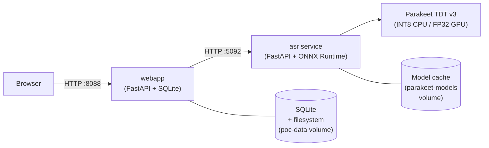

# Parakeet ASR Server

**OpenAI-compatible speech-to-text server powered by NVIDIA Parakeet TDT 0.6B v3 — with streaming, async jobs, web UI, multi-language interface, speaker diarization, and optional OIDC per-user workspaces.**


---

## Features

- **OpenAI-compatible API** — drop-in replacement for `openai.Audio.transcriptions.create()` with no client changes
- **SSE streaming** — `POST /v1/audio/transcriptions/stream` sends incremental results as VAD chunks are processed
- **Async jobs** — `POST /v1/audio/transcriptions/async` + `GET /v1/audio/jobs/{id}` for long audio without HTTP timeouts
- **Web UI** — React SPA: upload audio, play back, click timestamped segments, search transcriptions, export subtitles (SRT / VTT / TXT)
- **Multi-language UI** — English (default), Deutsch, Português — switchable via dropdown
- **VAD silence trimming** — optional pre-ASR trim via `VAD_TRIM_SILENCE=true` (toggle per upload)
- **Speaker diarization** — optional pyannote.audio-based speaker labels in segments and exports (toggle per upload, requires admin-set `HF_TOKEN`)
- **OIDC authentication** — optional per-user workspaces via any standard OIDC provider (auth.example.com, Keycloak, Authentik, etc.)
- **Persistent storage** — SQLite + filesystem (docker volume); survives container restarts
- **GPU & CPU** — INT8 ONNX for CPU, FP32/FP16 ONNX for NVIDIA GPU
- **Multilingual ASR** — Parakeet TDT v3 covers English and many European languages including German, Portuguese
- **Metrics endpoint** — queue depth, request count, average and p95 latency

---

## Quickstart

**Requirements:** Docker with Compose v2. For GPU: NVIDIA Container Toolkit.

```bash
git clone https://gitlab.example.com/tilllt/polyschnack-asr/parakeet-asr.git
cd parakeet-asr
docker compose -f compose.yml up -d
```

- Web UI: http://localhost:8088
- ASR API (direct): http://localhost:5092

The ASR service downloads the ONNX model (~600 MB) from HuggingFace on first boot into the
`parakeet-models` docker volume. Subsequent starts reuse the cache.

### curl

```bash
curl -s http://localhost:5092/health

curl -X POST http://localhost:5092/v1/audio/transcriptions \
  -F "file=@/path/to/audio.wav" \
  -F "model=parakeet-tdt-0.6b-v3" \
  -F "response_format=json" | jq .text
```

### Python (OpenAI client)

```python
from openai import OpenAI

client = OpenAI(
    api_key="not-used",
    base_url="http://localhost:5092/v1",
)

with open("audio.wav", "rb") as f:
    result = client.audio.transcriptions.create(
        model="parakeet-tdt-0.6b-v3",
        file=f,
    )
print(result.text)
```

> **Using it from your code?** See **[docs/API.md](docs/API.md)** — copy-paste
> recipes for the OpenAI SDK (Python/JS), **LangChain**, **Langfuse** (tracing),
> **Agno**, plus SSE streaming and async jobs.

---

## Architecture



Both services run as docker containers under a single `docker compose up`. The ASR service
is also usable standalone (port 5092 is exposed). The web app stores uploaded audio and
transcription records persistently and proxies transcription requests to the ASR service.

---

## compose.yml Reference

The complete `compose.yml` with all options:

```yaml
services:
  asr:
    image: registry.example.com/public/parakeet-asr:latest
    container_name: parakeet-asr
    environment:
      PARAKEET_USE_GPU: "true"
      PARAKEET_DEFAULT_MODEL: istupakov/parakeet-tdt-0.6b-v3-onnx
      PARAKEET_INFER_WORKERS: "1"
      PARAKEET_CHUNK_TARGET_SEC: "20"
      PARAKEET_CHUNK_MAX_SEC: "25"
      PARAKEET_CHUNK_MIN_SEC: "10"
    ports:
      - "5092:5092"
    volumes:
      - parakeet-models:/app/models
    restart: unless-stopped
    runtime: nvidia                # ← requires NVIDIA Container Toolkit
    deploy:
      resources:
        limits:
          memory: 8G

  webapp:
    image: registry.example.com/public/parakeet-asr-webapp:latest
    container_name: parakeet-webapp
    environment:
      ASR_URL: "http://asr:5092"
      ASR_MODEL: parakeet-tdt-0.6b-v3
      DATA_DIR: /data

      # Optional: VAD silence trimming (per-upload toggle in UI)
      VAD_TRIM_SILENCE: "false"    # "true" to enable

      # Optional: HuggingFace token for speaker diarization
      # Get at https://huggingface.co/settings/tokens
      # Accept terms at pyannote/speaker-diarization-3.1 and segmentation-3.0
      HF_TOKEN: ""

      # Optional OIDC — uncomment to enable per-user workspaces
      # OIDC_CLIENT_ID: "parakeet-asr"
      # OIDC_CLIENT_SECRET: "your-client-secret"
      # OIDC_ISSUER: "https://auth.example.com"     # or your Keycloak/Authentik URL
      # OIDC_SCOPE: "openid profile email"
      # SESSION_SECRET: "random-32-char-secret"  # openssl rand -hex 16
      # BASE_URL: "https://parakeet.example.com"     # must match OIDC redirect URI
    ports:
      - "8088:8080"
    volumes:
      - poc-data:/data
    depends_on:
      asr:
        condition: service_healthy
```

---

## Web UI Features

### Language

The UI supports English (default), Deutsch, and Português. Switch via the dropdown
in the header. Setting persists for the session.

### VAD (Silence Trimming)

Toggle below the upload zone. When enabled, leading and trailing silence is stripped
from the audio **before** sending it to the ASR service. Saves processing time on
recordings with long silence at start/end (voice messages, dictation).

The Silero VAD model (~5 MB ONNX) is downloaded lazily on first use.

### Speaker Diarization

Toggle below the upload zone. When enabled, pyannote.audio runs after transcription
and assigns speaker labels (`SPEAKER_01`, `SPEAKER_02`, etc.) to each segment.
Speaker labels appear in the UI and in exported SRT/VTT files.

**Requires the admin to set `HF_TOKEN`** in compose.yml. The toggle is silently
disabled when no token is present — users are not prompted or warned.

The pyannote model (~300 MB) is downloaded lazily from HuggingFace on first use.

### Export Formats

Click the Download button on any completed recording to export as:
- **TXT** — plain text transcript
- **SRT** — SubRip subtitles with timestamps
- **VTT** — WebVTT subtitles with timestamps

If diarization was enabled, exports include speaker prefixes (`[SPEAKER_01] ...`).

---

## OIDC Authentication (Admin Setup)

When OIDC is configured, authenticated users see only their own uploads —
isolated workspaces automatically.

**Step 1: Create an OIDC application in your provider**

Example for **Authentik**:
- Provider → OAuth2/OpenID Provider → Create
- Redirect URIs: `https://parakeet.example.com/auth/callback`
- Save Client ID + Client Secret

Works with any standard OIDC provider (Authentik, Keycloak, auth.example.com, Google, etc.)
via automatic `.well-known/openid-configuration` discovery.

**Step 2: Set env vars in compose.yml**

```yaml
  webapp:
    environment:
      OIDC_CLIENT_ID: "parakeet-asr"
      OIDC_CLIENT_SECRET: "your-client-secret"
      OIDC_ISSUER: "https://auth.example.com"
      OIDC_SCOPE: "openid profile email"
      SESSION_SECRET: "random-32-char-secret"
      BASE_URL: "https://parakeet.example.com"
```

> **`BASE_URL` must match the `redirect_uri` registered in your OIDC provider.**
> When running behind a reverse proxy (Traefik, Caddy, nginx), set this to the
> external URL.

**Step 3: Restart**

```bash
docker compose -f compose.yml up -d
```

Users see a **Login** button in the header. After login, they see only their recordings.
**Without OIDC configured** the app runs in shared (no-auth) mode as before.

---

## Configuration Reference

### ASR service environment variables

| Variable | Default | Description |
|----------|---------|-------------|
| `PARAKEET_USE_GPU` | `true` | `true` / `false` / `auto` |
| `PARAKEET_DEFAULT_MODEL` | `istupakov/parakeet-tdt-0.6b-v3-onnx` | Model key. CPU: `parakeet-tdt-0.6b-v3` (INT8) |
| `PARAKEET_INFER_WORKERS` | `1` | Parallel chunk inference threads |
| `PARAKEET_CHUNK_TARGET_SEC` | `60` (compose: `20`) | Target VAD chunk length |
| `PARAKEET_CHUNK_MAX_SEC` | `75` (compose: `25`) | Hard cap per chunk |
| `PARAKEET_CHUNK_MIN_SEC` | `20` (compose: `10`) | Min chunk before forced silence cut |
| `PARAKEET_GPU_DEVICE_ID` | `0` | CUDA device index |
| `PARAKEET_VAD_THRESHOLD` | `0.5` | Silero-VAD speech probability threshold |
| `LOG_LEVEL` | `INFO` | Logging verbosity |

### Web app environment variables

| Variable | Default | Description |
|----------|---------|-------------|
| `ASR_URL` | `http://asr:5092` | ASR service base URL |
| `ASR_MODEL` | `parakeet-tdt-0.6b-v3` | Model name for transcription requests |
| `DATA_DIR` | `/data` | Root for SQLite DB + audio files |
| `VAD_TRIM_SILENCE` | `false` | Enable VAD silence trimming (toggle in UI) |
| `HF_TOKEN` | `""` | Required for speaker diarization (set by admin) |
| `OIDC_CLIENT_ID` | `""` | OIDC client ID (leave empty = no auth) |
| `OIDC_CLIENT_SECRET` | `""` | OIDC client secret |
| `OIDC_ISSUER` | `""` | OIDC issuer URL (e.g. `https://auth.example.com`) |
| `OIDC_SCOPE` | `openid profile email` | OIDC scopes |
| `SESSION_SECRET` | auto-generated | Session cookie signing key |
| `BASE_URL` | `http://localhost:8088` | External URL for OIDC redirects |

---

## Development

### Prerequisites

- [uv](https://docs.astral.sh/uv/) (Python package manager)
- Node.js 20+ (for frontend)
- Docker with Compose v2

### ASR service (approach-a)

```bash
cd approach-a
uv sync
uv run uvicorn parakeet_service.main:app --reload --port 5092
```

### Web app

```bash
cd webapp/frontend
npm install
npm run dev              # Vite dev server on :5173

# In another terminal:
cd webapp
ASR_URL=http://localhost:5092 uv run uvicorn app.main:app --reload --port 8080
```

### Generate test audio fixtures

```bash
cd approach-a
uv run python scripts/gen_test_audio.py
```

---

## Project Structure

```
parakeet-asr-server/
├── compose.yml                    # Production stack (pulls pre-built images)
├── docker-compose.yml             # Legacy source build
├── approach-a/                    # ASR service
│   ├── Dockerfile.cpu / .gpu
│   └── parakeet_service/
├── webapp/                        # Web UI (React + FastAPI)
│   ├── Dockerfile
│   ├── pyproject.toml
│   ├── frontend/                  # React SPA (Vite + TypeScript)
│   │   └── src/
│   │       ├── App.tsx
│   │       ├── useLocale.ts       # i18n (de, en, pt-BR)
│   │       ├── api.ts             # API client
│   │       └── components/
│   │           ├── UploadZone.tsx  # Upload + VAD/diarization toggles
│   │           ├── SegmentList.tsx # Speaker labels
│   │           └── ...
│   └── app/                       # Python backend
│       ├── main.py
│       ├── models.py              # Recording + User tables
│       ├── crud.py                # DB operations
│       ├── vad.py                 # Silero VAD trimming
│       ├── diarize.py             # pyannote diarization wrapper
│       └── routers/
│           ├── recordings.py      # API endpoints
│           ├── models.py          # Model download status
│           └── auth.py            # OIDC login/logout/callback
├── docs/
│   └── API.md
└── tests/
```

---

## License

[MIT](LICENSE)
