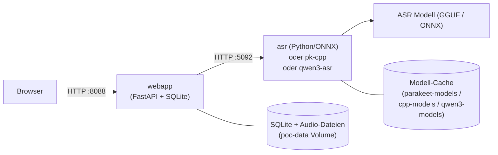

# PolySchnack — Multi-Backend Speech-to-Text

**OpenAI-kompatible Spracherkennung mit wählbaren ASR-Backends** — von lokalen
ggml/C++-Engines bis zur Cloud-API. Mit Web UI, Live-Transkription, Word-Timestamps,
Sprechererkennung (Diarization) und OIDC-per-Benutzer-Workspaces.


---

## Überblick

PolySchnack ist aus **[Parakeet ASR](https://github.com/nvidia/parakeet)** von
**NVIDIA** (ursprünglich [istupakov/parakeet-tdt](https://github.com/istupakov/parakeet-tdt))
entstanden und wurde **massiv erweitert**:

- **Multi-Backend-Architektur** — wähle zwischen Python/ONNX, parakeet.cpp (ggml/C++),
  Qwen3-ASR (ggml/C++) und weiteren Backends — ohne Code-Änderung
- **Moderne Web UI** mit WaveSurfer-Wellenform, Zoom, Segment-Editor,
  Echtzeit-Vorschau, Export (SRT/VTT/TXT)
- **Word-Timestamps** via Forced Alignment (Qwen3-ASR) oder
  Modell-inhärent (Parakeet)
- **Docker Compose** — ein Befehl, alle Backends profilierbar

> **Danke an die ursprünglichen Autoren:** Das Projekt startete als Fork von
> [istupakov/parakeet-tdt](https://github.com/istupakov/parakeet-tdt) (NVIDIA Parakeet
> TDT 0.6B v3) und dessen WebUI. Seitdem kamen hinzu: Multi-Backend-Adapter,
> OIDC-Auth, Diarization, Sprachauswahl, Segment-Editor, WaveSurfer-Integration
> und eine modulare C++-Backend-Architektur.

---

## Features

- **OpenAI-kompatible API** — Drop-in für `openai.Audio.transcriptions.create()`
- **Multi-Backend** — `ASR_BACKEND=pk-python|pk-cpp|qwen3-asr|voxtral` per Env-Var
- **Word-Timestamps** — echte Word-Level-Timestamps via ForcedAligner (Qwen3-ASR)
- **Web UI** — Upload, Playback, Zoom, Crop, Segment-Edit, Export
- **Live Preview** — SSE Streaming zeigt Text chunkweise an
- **VAD** — Silero-VAD für Stille-Erkennung und Trimmung
- **Diarization** — pyannote-basierte Sprechererkennung
- **Noise Reduction** — spektrale Rauschunterdrückung
- **Multi-Language UI** — English · Deutsch · Português
- **OIDC Auth** — Per-Benutzer-Workspaces via Authentik, Keycloak uvm.
- **Duplicate Detection** — Blake2b-Hash verhindert doppelte Uploads
- **Auto-Retention** — Automatische Löschung öffentlicher Aufnahmen

---

## Quickstart

**Voraussetzung:** Docker mit Compose v2. Für GPU: NVIDIA Container Toolkit.

```bash
git clone <dein-repo-url>
cd polyschnack

# Standard: Python/ONNX-Backend (Parakeet TDT 0.6B)
docker compose up -d
```

- **Web UI:** http://localhost:8088
- **ASR API (direkt):** http://localhost:5092

---

## Backend-Auswahl für Einsteiger

PolySchnack unterstützt **mehrere ASR-Engines**. Du wechselst einfach per
Env-Variable — kein Code nötig.

| Backend | Profil | CLI-Name | Beschreibung |
|---------|--------|----------|-------------|
| **Parakeet (Python/ONNX)** | *(Default)* | `pk-python` | Das Original-Modell von NVIDIA, 0,6B Parameter. Läuft auf CPU oder GPU. |
| **parakeet.cpp (ggml/C++)** | `--profile cpp` | `pk-cpp` | Gleiches Modell, aber in C++ — schneller und schlanker (~700 MB quantisiert). |
| **Qwen3-ASR (ggml/C++)** | `--profile qwen3` | `qwen3-asr` | Neuestes ASR-Modell von Alibaba, 30 Sprachen, **Word-Timestamps** via ForcedAligner (~3 GB beide Modelle). |
| **Voxtral** | *(kommt)* | `voxtral` | Mistral AI — Speech-to-Text, 4B Parameter, natives Streaming. |

### Parakeet (Python/ONNX) — Standard, einfach loslegen

```bash
docker compose up -d
```

Das ASR-Modell (~600 MB) wird beim ersten Start von HuggingFace geladen.
Keine Konfiguration nötig. Läuft auf CPU oder GPU.

### parakeet.cpp — schneller und schlanker

```bash
ASR_URL=http://asr-cpp:8080 ASR_BACKEND=pk-cpp \
  docker compose --profile cpp up -d
```

Das GGUF-Modell (~700 MB) muss einmalig geladen werden:
```bash
docker run --rm -v cpp-models:/models alpine wget -O /models/parakeet-tdt-0.6b-v3-q8_0.gguf \
  https://huggingface.co/mudler/parakeet-cpp-gguf/resolve/main/parakeet-tdt-0.6b-v3-q8_0.gguf
```

### Qwen3-ASR — beste Spracherkennung + Word-Timestamps

```bash
ASR_URL=http://qwen3-asr:8080 ASR_BACKEND=qwen3-asr \
  docker compose --profile qwen3 up -d
```

Zwei Modelle (~3 GB): ASR (Q8_0) + ForcedAligner (F16) müssen geladen werden:
```bash
docker run --rm -v qwen3-models:/models alpine sh -c '
  wget -qO /models/qwen3-asr-0.6b-q8_0.gguf \
    https://huggingface.co/ggml-org/Qwen3-ASR-0.6B-GGUF/resolve/main/qwen3-asr-0.6b-q8_0.gguf &&
  wget -qO /models/qwen3-forced-aligner-0.6b-f16.gguf \
    https://huggingface.co/ggml-org/Qwen3-ASR-0.6B-GGUF/resolve/main/qwen3-forced-aligner-0.6b-f16.gguf
'
```

---

## Architektur



Die Webapp kommuniziert mit dem ASR-Backend über die OpenAI-kompatible
`POST /v1/audio/transcriptions`-Schnittstelle. Der Adapter wird durch die
Umgebungsvariable `ASR_BACKEND` gesteuert.

---

## Web UI Features

### Upload & Transcribe

1. **Datei hochladen** — Drag & Drop oder Klick (MP3, WAV, OGG, OPUS, M4A, FLAC, WEBM)
2. **Toggles setzen** — VAD, Diarization, Noise Reduction, Live Preview vor dem Start
3. **Wellenform + Zoom** — WaveSurfer mit Zoom (1×–50×)
4. **Bereich wählen** — blauen Griff ziehen, um nur einen Ausschnitt zu transkribieren
5. **▶ Transkribieren** — Button startet die Verarbeitung
6. **Playback** — Klick auf Segment zum Abspielen

### Weitere Features

- **Segment-Editor** — Doppelklick auf Text, `Ctrl+Enter` speichert
- **Export** — SRT, VTT, TXT (mit Sprecher-Labels wenn Diarization aktiv)
- **Duplicate Detection** — gleiche Datei erkennen und überspringen
- **Auto-Retention** — öffentliche Aufnahmen nach 60 Minuten löschen

---

## Konfiguration

### ASR-Backend wählen

| Variable | Werte | Default |
|----------|-------|---------|
| `ASR_BACKEND` | `pk-python`, `pk-cpp`, `qwen3-asr` | `pk-python` |
| `ASR_URL` | URL des ASR-Dienstes | `http://asr:5092` |

### Webapp-Umgebungsvariablen

| Variable | Default | Beschreibung |
|----------|---------|-------------|
| `ASR_URL` | `http://asr:5092` | ASR-Service-URL |
| `ASR_BACKEND` | `pk-python` | Welcher Adapter |
| `VAD_TRIM_SILENCE` | `false` | Stille-Trimmung aktivieren |
| `HF_TOKEN` | `""` | HuggingFace-Token für Diarization |
| `PUBLIC_RETENTION_MINUTES` | `60` | Auto-Löschung öffentl. Aufnahmen |
| `OIDC_CLIENT_ID` | `""` | OIDC-Client-ID (leer = kein Auth) |
| `OIDC_ISSUER` | `""` | OIDC-Issuer-URL |
| `SESSION_SECRET` | auto | Session-Key |
| `BASE_URL` | `http://localhost:8088` | Externe URL für OIDC-Redirects |

---

## Entwicklung

### Voraussetzungen

- [uv](https://docs.astral.sh/uv/) (Python Package Manager)
- Node.js 20+
- Docker mit Compose v2

### ASR Backend (approach-a)

```bash
cd approach-a
uv sync
uv run uvicorn parakeet_service.main:app --reload --port 5092
```

### Web App

```bash
cd webapp/frontend
npm install
npm run dev              # Vite Dev Server auf :5173

# Zweites Terminal:
cd webapp
ASR_URL=http://localhost:5092 uv run uvicorn app.main:app --reload --port 8080
```

---

## License

[MIT](LICENSE) — basiert auf [istupakov/parakeet-tdt](https://github.com/istupakov/parakeet-tdt)
(NVIDIA Parakeet TDT 0.6B v3) und [mudler/parakeet.cpp](https://github.com/mudler/parakeet.cpp).
