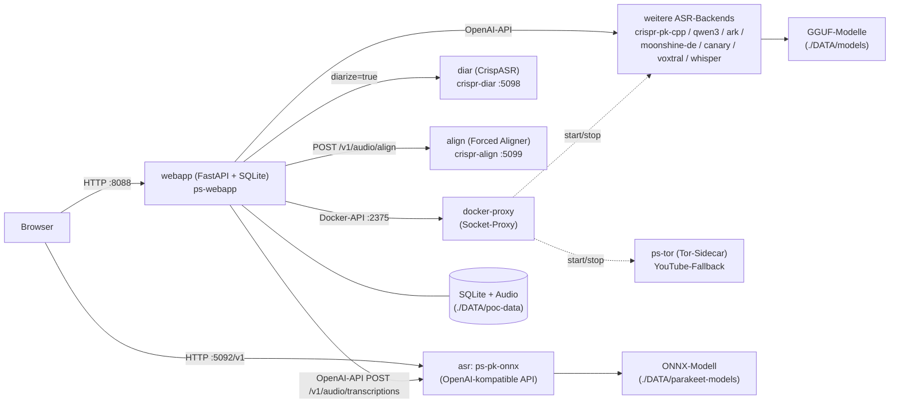

# Architektur

Diese Seite erklärt PolySchnack auf Systemebene: Container, Ports,
Datenfluss, Speicherlayout und die wichtigsten Design-Entscheidungen.
Wer den **Code** verstehen will (Dateien, Funktionen, Zusammenspiel), findet
das im [Code-Guide](development/code-guide.md).

## Systemüberblick

**Kern-Stack** (`compose.yml`): `webapp` (GUI + API), `asr`
(ps-pk-onnx, das Standard-Backend), `diar` (Sprechererkennung), `align`
(Word-Level-Timestamps) und `docker-proxy` (sichere Container-Steuerung).

**Optionale Backends** (`compose.backends.yml`, per Docker-Profil): weitere
ASR-Engines + `ps-tor` (Tor-Sidecar für den YouTube-Import-Fallback,
Change 043). Die Webapp spricht **alle** Backends über die OpenAI-kompatible
`POST /v1/audio/transcriptions`-Schnittstelle an.

## Ports

| Port | Service | Host-gebunden | Zweck |
|------|---------|:---:|---|
| 8088 | `webapp` | ✅ | Web-UI + Webapp-API |
| 5092 | `ps-pk-onnx` | ✅ | OpenAI-kompatible ASR-API (Standard-Backend) |
| 5093 | `crispr-pk-cpp` | ✅ | parakeet.cpp (CrispASR) |
| 5094 | `crispr-qwen3` | ✅ | Qwen3-ASR (CrispASR) |
| 5095 | `crispr-ark` | ✅ | ARK-ASR (CrispASR) |
| 5096 | `crispr-moonshine-de` | ✅ | Moonshine-DE (CrispASR) |
| 5097 | `crispr-canary` | ✅ | Canary (CrispASR) |
| 5100 | `crispr-voxtral` | ✅ | Voxtral-Mini-4B (CrispASR) |
| 5101 | `crispr-whisper` | ✅ | Whisper large-v3-turbo (CrispASR) |
| 5098 | `crispr-diar` | — (nur intern) | Diarization (CrispASR) |
| 5099 | `crispr-align` | — (nur intern) | Forced Aligner (Word-Timestamps) |
| 2375 | `docker-proxy` | — (nur intern) | Restriktive Docker-Steuerung |
| 9050 | `ps-tor` | — (nur intern) | SOCKS5-Proxy für Download-Fallback |

Inter-Service-URLs nutzen immer den **Container-Port** im Compose-Netzwerk
(z. B. `http://crispr-diar:5098`), nicht das Host-Port-Mapping. Die
Adapter-URLs sind pro Backend konfigurierbar (siehe
[Backend-Übersicht](backends/overview.md)).

## Datenfluss: Eine Transkription

1. **Upload** (`POST /api/recordings`): Datei wird nach `./DATA/poc-data/`
   gespeichert (native Formate unkonvertiert, on-the-fly WAV für Backends,
   die nur WAV akzeptieren), Peaks werden im Hintergrund berechnet
   (`peaks.py`, 16 kHz mono), MP3-Preview-Sidecar on demand.
2. **Queue** (`queue.py`): Der Transcribe-Job landet in der Warteschlange —
   pro Backend seriell (Kapazität 1), mit Position + ETA in der UI.
   Admin/Anon-Gating: Anon-User sehen nur laufende Backends, Admins können
   nicht-laufende Backends automatisch starten (Ressourcen-Check vorher).
3. **ASR** (`service.py` → Adapter): Die Webapp schickt das Audio an das
   gewählte Backend (`verbose_json`, Wort-Zeitstempel anfordern).
4. **Align** (`aligner_client.py` → `crispr-align`): verifiziert jede
   Wortgrenze gegen die Akustik (qwen3-forced-aligner, Chunks ≤ 400 s) —
   behebt den Karaoke-Drift bei langen Audios. Steuerbar per
   `POLYSCHNACK_ALIGN_WORDS`.
5. **Diarization** (`diarize.py` → `crispr-diar`): falls aktiv, werden
   Sprecher-Labels per `diarize=true&response_format=diarized_json`
   ermittelt und mit den Wort-Streams zusammengeführt (Flicker-Smoothing,
   Overlap-Zuordnung — siehe [Diarization](diarization.md)).
6. **Post-Processing** (opt-in): Interpunktion/Truecasing (nativ im
   CrispASR-Server oder per LLM), LLM-Optimierung, Prompt-Vorlagen →
   neue Version, Delivery (E-Mail/WebDAV).
7. **Live-Modus** (`/v1/audio/transcriptions/stream`-artig, SSE): das
   Frontend pollt während `processing` alle 2 s — Text und Fortschritt
   erscheinen live, solange das Backend Streaming unterstützt.

## Speicherlayout (`./DATA`)

| Pfad | Inhalt |
|---|---|
| `./DATA/poc-data/` | SQLite (`app.db`), Audiodateien, Preview-MP3s, Versionen |
| `./DATA/models/` | Gemeinsame GGUF-Modelle aller CrispASR-Backends + diar + aligner (Bind-Mount, Backends read-only) |
| `./DATA/parakeet-models/` | ONNX-Modell des Standard-Backends (auto-download) |
| `./DATA/benchmark/` | Benchmark: versionierte Manifeste, WAV/MP3-Samples, `results/latest.json`, `pricing.json` |

Alles sind **Bind-Mounts**, keine Named-Volumes. Die Pfade sind über
`DATA_DIR`/`AUDIO_DIR`/`BENCHMARK_DATA_DIR` konfigurierbar.

## Design-Entscheidungen

- **Webapp ist CPU-only** — kein torch/pyannote im Image (~2,5–3 GB
  schlanker); Diarization läuft extern im `crispr-diar`-Container.
- **Hybride Backend-Images** — jedes Image enthält CUDA-Binary + CPU-Fallback
  (`ggml_backend_init_best` = CUDA > Metal > Vulkan > CPU; approach-a nutzt
  `POLYSCHNACK_USE_GPU=auto`). GPU-Zugriff wird **ausschließlich** über
  `compose.gpu.yml` (`runtime: nvidia`) vergeben.
- **Docker-Socket nur über Proxy** — die Webapp spricht nie direkt den
  Docker-Socket an, sondern `docker-proxy` (tecnativa/docker-socket-proxy,
  nur Container-/Info-Routen; Exec/Create/Events deaktiviert).
- **`backends.yaml` ist die Single Source of Truth** für Backend-Wissen
  (Name, Port, Modell-Downloads, Capabilities, Adapter) — das Manage-Skript
  leitet daraus Profile + Modell-Downloads ab, die Webapp Registry und
  Feature-Matrix (siehe [Compose-Referenz](compose.md)).
- **Lite-Liste + Nachladen** (Change 059): `GET /api/recordings?lite=1`
  liefert nur Karten-Metadaten; Transkription + Peaks lädt das Frontend pro
  Karte nach (`GET /api/recordings/{uid}`) — schnelle UI auch im langsamen
  Netz (siehe [Web UI](webui.md)).
- **Kollaboration über Yjs** — parallele Bearbeitung mehrerer User über
  WebSocket-Räume (`webapp/app/yjs/`), persistiert am Ende als Version.

## Images & Registries

| Registry | Zweck |
|---|---|
| **GHCR** (`ghcr.io/tilllt/polyschnack-asr*`) | Public Image-Mirror, **compose-Default** (`${REGISTRY:-ghcr.io/tilllt}`); Tags `latest` + CalVer (`YYYY.M.N`) + Commit-SHA, automatisch per GitLab-CI gespiegelt |
| **Harbor** | Private Dev-Registry (intern); `REGISTRY=<dev>/public ./polyschnack-manage.sh start` für Dev-Stände |
| **GitHub** (`github.com/tilllt/polyschnack-asr`) | Public Code-Mirror jedes `main`-Pushes; dort läuft CI als GitHub Actions (`.github/workflows/ci.yml`, Tests) |

**Versionierung (CalVer):** Tags `latest` = `YYYY` = `YYYY.M` = `YYYY.M.N`
(Jahr.Monat.Build, Build = max existierende `YYYY.M.*` + 1). Die Webapp zeigt
die Version unten im Footer und via `GET /api/version`.

## Konfiguration & Deployment

- Alle Env-Variablen: [Konfiguration](configuration/env.md)
- Compose-Dateien & Profile: [Compose-Referenz](compose.md)
- Deployment-Workflow (`polyschnack-manage.sh`): [Quickstart](quickstart.md)
