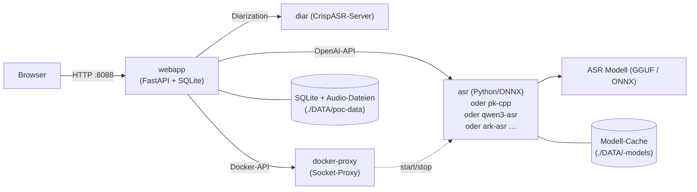

# Architektur

Die Webapp kommuniziert mit den ASR-Backends über die OpenAI-kompatible
`POST /v1/audio/transcriptions`-Schnittstelle. Der Adapter wird durch die
Umgebungsvariable `ASR_BACKEND` gesteuert (jedes Backend hat seine eigene
URL-Env — siehe [Backend-Übersicht](backends/overview.md)).

Die Diarization läuft im eigenen `diar`-Container (CrispASR-Server,
`POST /v1/audio/transcriptions` mit `diarize=true&response_format=diarized_json`).

Die Admin-GUI steuert die Backend-Container über den restriktiven
`docker-proxy` (kein direkter Docker-Socket-Zugriff aus der Webapp).

## Wichtige Design-Entscheidungen

- **Webapp ist CPU-only** — kein torch/pyannote im Image, ~2,5–3 GB schlanker.
- **Diarization als eigener Container** — unabhängig vom ASR-Backend wählbar.
- **Hybride Backend-Images** — CUDA-Binary mit CPU-Fallback, GPU nur via
  Overlay (siehe [Quickstart](quickstart.md)).
